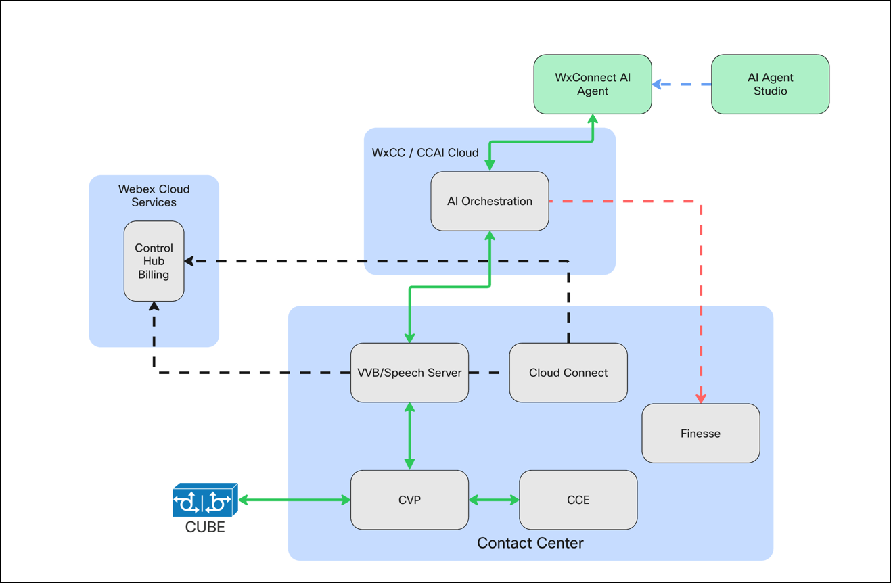
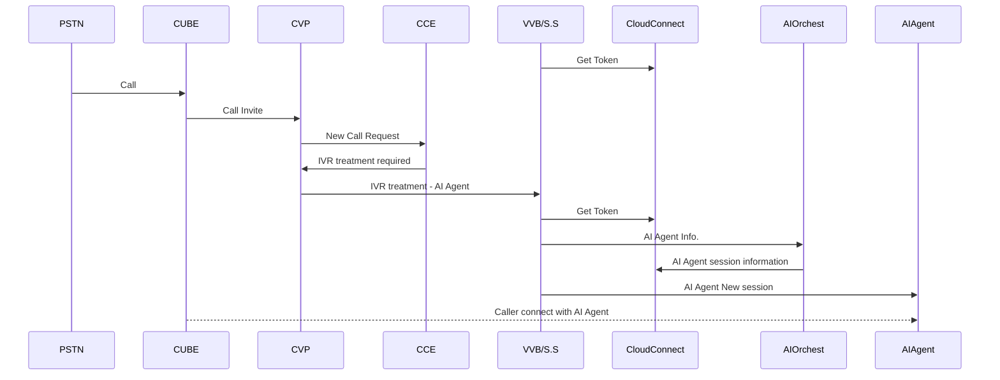
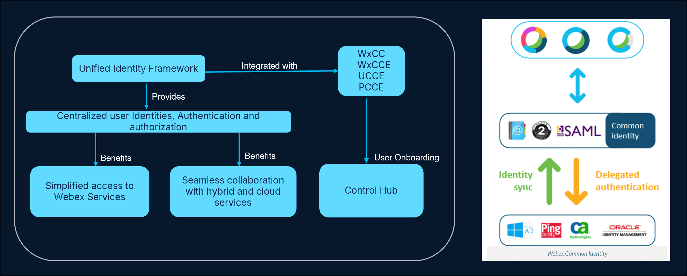
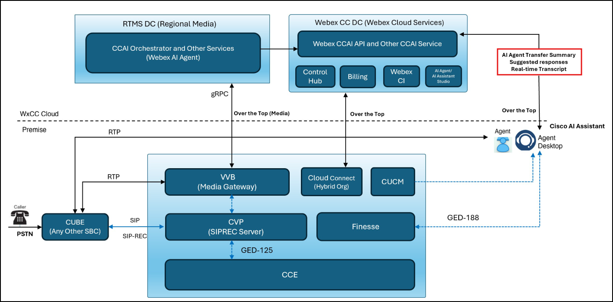
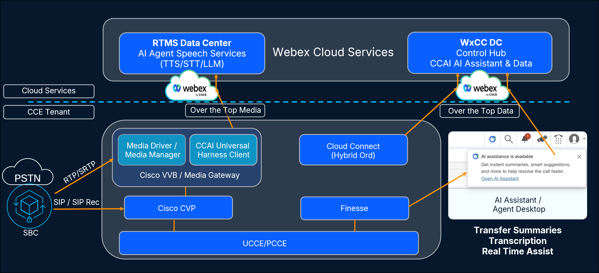

# Introduction - Getting Started

## **Objectives**

In this lab you will:

 - Know how to access the components used to deliver this lab and how to access each part
 - Know what AI Features will be set up as part of this class.
 - Know the prerequisites required to set up the various AI Features in this lab.

**Note:** This is a read only lab. There are no configuration tasks you need to accomplish.

## **Task 1. Introduction to Webex AI Agent**

Webex AI Agent refers to an artificial intelligence virtual agent integrated into Cisco WebexCCE or CCE. These AI Agents are designed to enhance customer service and support by automating interactions, assisting human agents, and providing analytics-driven insights.

### **Webex AI Agent Components**

   

In both the CCE on-premises solution and the Webex CCE tenant, several key components are integral to the Webex AI Agent solution. These include Cisco Unified Voice Portal (CVP), CVP Call Studio, VVB/Speech Server, the CCE core, and Cloud Connect. On the cloud side, the main components consist of Cisco Webex Cloud Services (such as Control Hub, Billing, etc.), AI Orchestration services, the Webex Connect AI Agent, and the AI Agent Studio.

**CVP:** Enables automated customer self-service and call routing, acting as an Interactive Voice Response (IVR) system integrated with CCE / WxCCE. It works with the VVB and Speech Server to provide AI Agent integration in the IVR flow.  

**CVP Call Studio:** CVP Call Studio is a development platform for creating voice applications.

**VVB/Speech Server:**  is designed to facilitate concurrent multimedia or IVR communication processing. The speech Server communicates the request from customer/caller to the AI orchestration services using gRPC.

**CCE Core:** Peripheral Gateways, the Router, Admin Workstation, and other CCE components work together to process incoming requests and determine the most suitable destination to handle them. The Admin Workstation (AW) is where you configure and manage the overall CCE solution..

**Control Hub:** Control Hub serves as the central platform for managing and configuring Webex cloud solutions. From Control Hub, you can also provision and directly launch the AI Agent Studio.

**AI Orchestration:** Refers to Cisco's cloud-based services that handle incoming requests from customers through the WxCCE or CCE solution, then route those requests via a Cisco Connector to the Webex Connect AI Agent.

**AI Agent Studio:** AI Agent Studio helps to create the necessary workflows for Scripted AI Agent

There are two kinds of AI Agents:

??? tip "Scripted AI Agents"
    
    Scripted AI agents enhance the no-code agent-building capabilities of the Webex AI Agent Studio platform. They enable multi-turn conversations, gathering relevant data from customers to perform specific tasks. 
    
    This includes:    
    
    • **Running simple commands** — Follow instructions to complete predefined actions.
    • **Processing data** — Manipulate and transform data according to specified rules.
    • **Interacting with other systems** — Communicate with and control other solutions.
    
    Scripted AI agents are knowledge-driven agents whose knowledge base consists of a corpus of questions and answers. Scripted AI agent can provide answers based on a user-created training corpus, which is a collection of examples and answers. 
    
    This capability is useful in scenarios where:    
    
    • **Specific knowledge is required** — The agent needs to answer questions within a predefined domain.
    • **Consistency is important** — The agent must provide consistent responses to similar queries.
    • **Limited flexibility is needed** — The agent's responses are constrained by the information in the training corpus.

??? tip "Autonomous AI Agents"
    
    Autonomous AI agents operate independently without direct human intervention. Autonomous agents can access and use a knowledge repository to provide informative and accurate answers to user queries. These agents use advanced algorithms and machine learning techniques to analyze data, learn from their environment, and adapt their actions to achieve specific goals.
    
    You can use the autonomous AI agents in various scenarios, including:
    
    • **Provide customer support** — Answer FAQs, troubleshoot issues, and guide customers through processes.
    • **Offer technical assistance** — Provide expert advice on specific topics or domains.
    • **Natural Language Processing (NLP)** — Understand and respond to human language in a natural and conversational manner.
    • **Decision making** — Make informed choices based on available information and predefined rules.
    • **Automation** — Automate repetitive or time-consuming tasks.

More Information on:
[Webex AI Agent Studio Administration guide](https://help.webex.com/en-us/article/ncs9r37/Webex-AI-Agent-Studio-Administration-guide){:target="_blank"}

### **Webex AI Agent Call Flow**

Review the flow diagram below to understand how the components communicate.

1. At start up, VVB/Speech Server requests a token to Cloud Connect in order to authenticate with Webex Services and AI Orchestration.
2. Customers place a call.
3. Call is sent to CVP (Call control and IVR treatment) from Cisco Unified Border Element (CUBE).
4. CVP sends the call to CCE and receives the instructions to send the call to VVB for IVR Treatment.
5. VVB sends the request to Speech Server for further processing - connect the call to the virtual Agent (AI Agent).
6. Speech Server sends AI Agent Id and Event to the AI Orchestrator.
7. AI Orchestrator provides the session information (URI) of the AI Agent.
8. Speech Server creates a new session with Webex Connect and passes the welcome event which is configured in VAV element in CVP call studio.
9. Call is connected between the Caller and the AI Agent via the VVB/Speech Server.

## **Task 2. Introduction to Webex CI**

Webex Common Identity (CI) is a unified identity management system for Unified CCE. It manages user profiles and access permissions across the platform, enabling centralized control of authentication. This allows enterprises to efficiently manage agents and supervisors across multiple sites.

Key features of Webex CI:

 - Delivers single sign-on (SSO) capabilities and centralized user profile management.
 - As part of the unified identity platform, Webex CI integrates with CCE and is managed through Control Hub.
 - Enables AI features for Unified CCE deployment.
 - CCE supports SSO with Cisco IdS and Webex Common Identity, but only one can be configured for any user in Unified CCE deployment. This allows agents and supervisors to authenticate using either **Cisco IdS SSO** or **Webex CI**.
 - Supports bulk user management through CSV import and export.
 - Webex CI supports ECE for digital channels.
 - Federation with customer Identity Providers (IdPs) that are SAML 2.0 compliant.
 - Aligns with Cisco security and privacy requirements.

??? question "What's the purpose of Webex CI in the context of this class?"

     - Webex CI is required to enable AI features.
     - This unified identity approach helps enterprises maintain secure, efficient user access management for on-premises and cloud deployments.
     - For more information, visit [UCCE 15.0(1) SU1/ES202603 Release Notes](https://www.cisco.com/c/en/us/td/docs/voice_ip_comm/cust_contact/contact_center/icm_enterprise/icm_enterprise_15_0_1/release/guide/rcct-b-cce-release-notes-1501_es202603/rcct-m-feature-summary-1501-es202603.html#ca-features){:target="_blank"}.

   

## **Task 3. Introduction to Cisco AI Assistant Features**

Cisco AI Assistant presents agents and supervisors with AI-powered assistance to optimize customer interactions by providing AI-generated insights at multiple touch points throughout the agent–customer interaction. Administrators can enable or disable individual AI Assistant features for specific users using the Unified CCE Administration console.

These features are:

 - Virtual agent transfer summaries
 - Call transcripts
 - Real-Time Assist
 - Wrap-up summaries

**Virtual agent transfer summaries**

 - AI-generated transfer summaries deliver concise, context-rich summaries at critical points throughout the customer journey. 
 - By providing live agents with immediate visibility into prior AI-led interactions, this feature reduces customer repetition, accelerates issue resolution, and improves overall customer experience.
 - It offers concise summaries of prior interactions, allowing live agents to continue conversations seamlessly without needing to re-collect information. 
 - This immediate access enables agents to focus on delivering effective solutions, leading to faster resolutions and a more cohesive customer experience.

**Call transcript**

 - AI-generated call transcription automatically captures and presents complete transcriptions of interactions between customers and live agents. 
 - Live agents can quickly review the conversations, search for relevant details, and engage customers more effectively by asking informed, relevant questions.
 - Transcript offers full conversation transcripts between customers and AI agent to live agents, helps to efficiently search, copy, and reference the dialogue for improved query handling.

**Real-Time Assist**

 - AI generated real-time assist utilizes an automated backend workflow to deliver contextual message prompts to live agents, enabling them to respond swiftly with relevant, tailored suggestions during live engagements.
 - Real-Time Assist is a real-time feature in CCE designed to boost agent productivity and customer satisfaction. 
 - Using advanced AI capabilities, it delivers contextual guidance to agents during real-time agent-customer voice call. 
 - By providing timely, relevant suggestions for both dialogue and actions directly within the Agent Desktop.

**Wrap-up summaries**

 - An AI-generated draft created at the end of a customer call that captures key details such as the call reason, actions taken, resolution status, and follow-up tasks.
 - Agents can review, edit, and finalize this summary to reduce manual note-taking and improve documentation efficiency.
 - Wrap-up summary offers a concise summary of key call details at the end of an interaction, enabling agents to complete after-call work faster and more accurately.

### **Webex AI Features Call Flow**

1. A caller originates a call from the Service Provider PSTN.
2. The call is directed to CUBE, and SIP signaling (SIP/TLS) is transmitted to CVP.
3. CVP forwards communication to CCE, which leverages its ICM script, determines the appropriate call flow.
4. The CCE instructs CVP which invokes the Cisco VVB to handle the self-service interaction.
5. The VVB communicates with the CCAI Orchestrator services using GRPC.
6. The CCAI Orchestrator service invokes AI agent speech services (TTS/STT/LLM). This interaction involves a bidirectional media flow.
7. CCE instructs CVP to queue the call until an agent becomes available. When an agent is available, CCE sends the GED CONNECT message to the CVP. The GED CONNECT message indicates which Webex AI Features are enabled for that agent. CVP transfers the call to the agent through CUCM.
8. If the CCE script directs the call to an agent, the call is returned to CVP.
9. CCE sends the call information (which includes details on which Webex AI Features are enabled for that call) to the Finesse server.
10. When the call is in the IVR state, CUBE forks the media streams of the caller towards the CCAI Orchestrator service via the Cisco VVB. Once the agent is involved, CUBE initiates a SIP recording (SIPREC) session to CVP. CVP directly controls SIPREC on CUBE and instructs Media Gateway to fork the media streams from both the caller and the agent as needed.

    Note: Media forking commences only after the agent accepts the call.

11. The media from the Cisco VVB (or Media Gateway) is sent to the CCAI Orchestrator Service for AI processing.
12. The CCAI Orchestrator service then provides the analyzed media to the Transcript gadget via the Webex CCAI Service.
13. The Cisco AI Assistant gadget registers and receives responses from the Contact Center AI Services.
14. The Cisco AI Assistant and Transcript gadgets start displaying the response received from the Webex CCAI Service to the agent in real-time. If the call has gone through the IVR phase, the call transcript of that conversation is also displayed in the gadget.

### **AI Terminologies**

| Terminology | Description |
|---------|-------------|
| **Knowledge Base (KB)** | • A centralized repository of information, often organized and structured, that stores and retrieves data, articles, FAQs, guides, and other relevant content. • Its primary purpose is to make information easily accessible and searchable for its intended users. • A knowledge base significantly improves efficiency, reduces support costs, and enhances the overall customer and agent experience by ensuring that correct and timely information is always available. |
| **AI Agent** | • An AI Agent refers to an intelligent virtual assistant or bot designed to automate and enhance customer interactions. • These agents leverage Artificial Intelligence (AI) and Natural Language Processing (NLP) to understand customer queries, provide relevant information, and perform tasks without direct human intervention. • AI Agent helps in improving operational efficiency, reducing response times, and enhancing the overall customer experience by providing instant, consistent, and intelligent support. |
| **AI Assistant** | • AI Assistant functionalities are designed to enhance productivity for human agents by providing real-time guidance. • The AI capabilities in CCE and Webex CCE encompasses core component features such as AI-generated call transcripts, call summaries, and real-time assists that benefit both customers seeking help and agents providing it. • AI Assistant empowers human agents during direct customer interaction. • It leverages AI, machine learning, and natural language processing to achieve these goals. |
| **AI Assistant skill** | • An AI Assistant Skill is a predefined capability or knowledge domain that an AI Assistant (customer-facing or agent-facing) can execute. • These configurable entities, managed within the AI Assistant Skill Studio, function as specialized areas of expertise that are 'taught' or configured for the assistant. • They power the 'real-time assists' AI feature, providing agents with real-time contextual suggestions and actions, thereby serving as intelligent guides. • Each skill empowers the AI Assistant to understand and respond to specific user requests or perform pre-formulated tasks. • Upon interaction, the system identifies and activates the most relevant skill to deliver an appropriate response or action. |
| **AI Agent Studio** | • AI Agent Studio is a powerful, codeless platform that enables business users and administrators to design, build, and deploy AI-powered agents quickly and easily. • It allows creation of sophisticated AI agents using natural language prompts without requiring coding, supporting both voice and digital channels. • AI Agent Studio simplifies scaling AI-driven customer service by providing tools to train, manage, and deploy autonomous or scripted AI agents that automate routine interactions and enhance customer experience. |

## **Task 4. Version Requirements for various CCE Components**

| Server(s) | Version |
|---------|-------------|
| **ICM** | 15.0(1) + ES202607 |
| **CVP** | 15.0(1) + ES202607 |
| **Call Studio** | 15.0(1) Build-58 (*November 2025 release* ) |
| **Cloud Connect** | 15.0(1)SU2 |
| **Finesse** | 15.0(1)SU2 |
| **VVB** | 15.0(1)SU2  VVB Server can be set in 1 of 3 modes: &nbsp;&nbsp;&nbsp;&nbsp;1. VVB only   &nbsp;&nbsp;&nbsp;&nbsp;2. MGW only  &nbsp;&nbsp;&nbsp;&nbsp;3. Mixed-Mode (VVB + MGW)   *Media Gateway (MGW) is a service, enabled on the VVB VM, that supports media-forking towards the cloud services.*|
| **CUBE/vCUBE** | IOS version 17.18.2 or later on vCUBE 44xx and Catalyst 8xxx |

### **What is a Media Gateway (MGW)?**

 - Media Gateway is a new service available with the VVB server, starting version 15.0(1)SU1, that enables SIP-REC based forking from SBC toward CVP/VVB.
 - It allows media forking capabilities for the agent and the caller leg of the call flow.
 - The media forking is initiated by the CUBE or any third party Session Border Controllers (SBC) using the SIP Recording (SIPREC) protocol.
 - The Media Gateway converts SIP metadata and RTP stream to gRPC format and streams it to Cloud AI Services.
 - The Media Gateway configuration is a replacement for the previously used WebSocket based media forking.

   

??? question "Are any additional licenses required when setting up Media Gateway?"

    No additional MGW licenses required; just the standard CUBE licenses.

<strong>This now completes the Getting Started Section!</strong>
