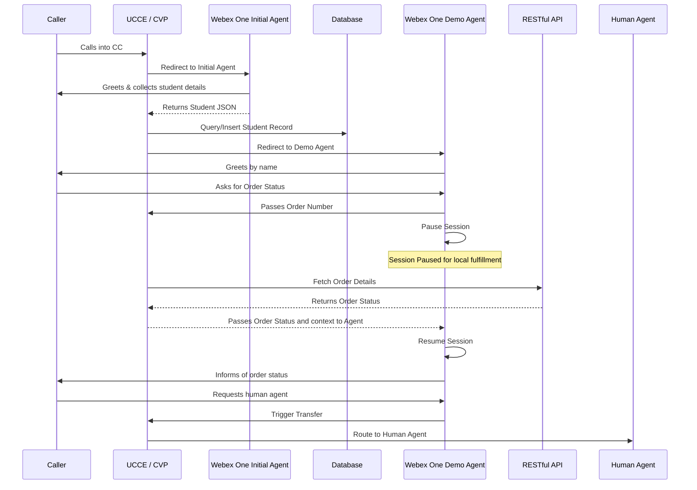
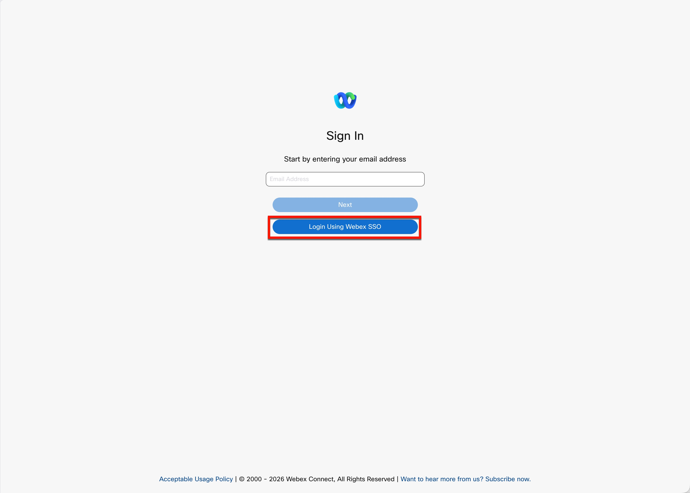
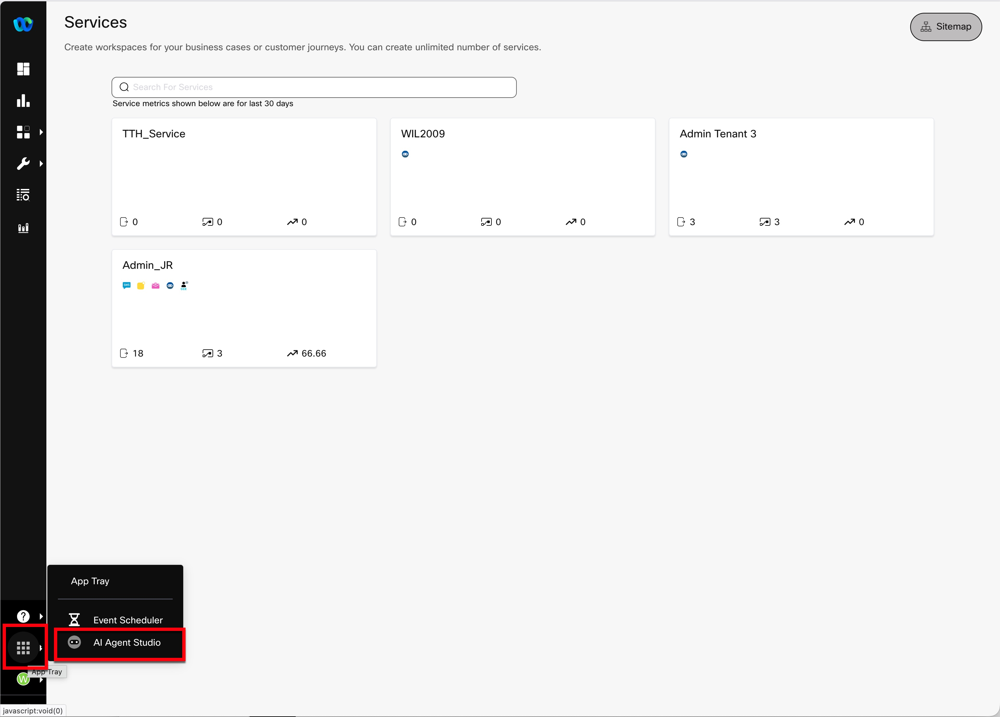

# Lab 1 - Configure and Import your Webex CI User

## **Objectives**

In this lab you will:

 - Review pre-configured AI Agents and understand how they work.
 - Understand the new features for European compliance
 - Understand how to pass data as part of transfer and fulfillment actions.
 - Understand how to parse data coming back from the AI Agent.


## **Task 1. Review AI Agent**

In this first task, we will review the AI Agents which were pre-configured for this class. Before we start this, please take a moment to review the diagram of the call flow:



1. Access **AI Agent Studio**

    - On **WKSTN1**, use Chrome to login to Webex Connect, [ciscolivetenant03.eu.webexconnect.io](https://ciscolivetenant03.eu.webexconnect.io/login){:target="_blank"} 


    - Select the button labeled, "Login Using Webex SSO", then use the following credentials:

         - ***Username:*** pcce.demo+webex1@gmail.com
         - ***Password:*** P@ssw0rd2026

        

    - In the black bar to the left, select the App Tray (grouping of 9 dots), then select "AI Agent Studio".

        

    - The landing page should be the AI Agents page, locate the AI Agent named "Webex One Initial Agent".

        

    - Review the sections below to explore the first AI Agent.

        - **Profile Tab**
            

            - [AI Engines Explanation](https://help.webex.com/en-us/article/ne6s80cb/Understand-AI-engines-for-AI-agents){:target="_blank"} 

        - **Instructions Tab**
            

        - **Knowledge Tab**
            Knowledge is not used in this AI Agent

        - **Actions Tab**

            

            - _Action Types_:
                - Transfer - These are used when you want to pass information back to the calling system. When a transfer action is called, the AI Agent session ends.
                - Fulfillment - These are used when you want to process information which is collected. When a fulfillment action is called, the AI Agent session is paused, retaining context until the fulfillment response is returned.
            
            - Click into the CollectStudentInfo action to review what it does.

                

                !!! note "Parameter Handling"             
                    Parameters are passed back to the calling application in JSON format. The example shown would be sent back to CVP in the following format. you will see that the escalation_trigger is the name of the action and the input section contains the values collected.
                    ```json
                    {
                    "escalation_type": "custom",
                    "escalation_trigger": "CollectStudentInfo",
                    "language": "en-US",
                    "actions": {
                        "CollectStudentInfo": [
                        {
                            "input": {
                            "firstName": "John",
                            "lastName": "Smith",
                            "stuID": "STU1"
                            },
                            "type": "transfer"
                        }
                        ]
                    }
                    ```

        - **Conversation Tab**

            The conversation tab tells your AI Agent how it should communicate with callers. Notice that there are a number of options which can control how tone, conversational style, language and voice.

        - **Side Bar**

            So far, we have looked at the Configuration sections. If you notice there are several other items in the side bar. While these are outside the scope of this class, we have included a list below of what each do.

                - Sessions: This section lists all of the sessions which have gone on with the agent. This section is useful for troubleshooting and understanding how each conversation happened.
                - History: This section shows the history of any commits to the AI Agent. Each time you make a change to the agent, you must save then publish the change

    - After you have reviewed the first AI Agent, select the Arrow at the top of the screen to return to list of AI Agents, then locate "Webex One Demo Agent".

    - 