# Lab 1 - Configure and Import your Webex CI User

## **Objectives**

In this lab you will:

 - Review pre-configured AI Agents and understand how they work.
 - Understand the new features for European compliance
 - Understand how to pass data as part of transfer and fulfillment actions.
 - Understand how to parse data coming back from the AI Agent.


## **Task 1. Review AI Agent**

In this first task, we will review the AI Agents which were pre-configured for this class. Before we start this, please take a moment to review the diagram of the call flow:

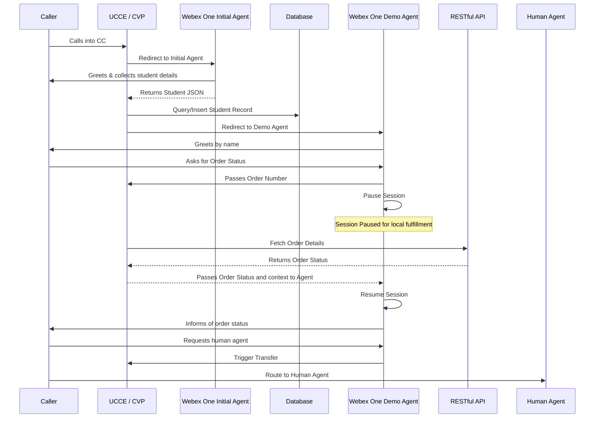
```mermaid
sequenceDiagram
    participant User as Caller
    participant CVP as UCCE / CVP 
    participant AI1 as Webex One Initial Agent
    participant DB as Database
    participant AI2 as Webex One Demo Agent
    participant API as RESTful API
    participant Human as Human Agent

    User->>CVP: Calls into CC
    CVP->>AI1: Redirect to Initial Agent
    AI1->>User: Greets & collects student details
    AI1-->>CVP: Returns Student JSON
    CVP->>DB: Query/Insert Student Record
    CVP->>AI2: Redirect to Demo Agent
    AI2->>User: Greets by name
    User->>AI2: Asks for Order Status
    AI2->>CVP: Passes Order Number 
    AI2->>AI2: Pause Session
    Note over AI2: Session Paused for local fulfillment
    CVP->>API: Fetch Order Details
    API-->>CVP: Returns Order Status
    CVP-->>AI2: Passes Order Status and context to Agent
    AI2->>AI2: Resume Session
    AI2->>User: Informs of order status
    User->>AI2: Requests human agent
    AI2->>CVP: Trigger Transfer
    User->>Human: Route to Human Agent
```

1. Access **AI Agent Studio**

    !!! warning "Do not make changes in this section"
        As this is a shared tenant, this portion of the lab is read only. Please ensure that you do not make any changes to the AI Agents.

    a. On **WKST1**, use Chrome to login to Collaboration Control Hub, [admin.webex.com](https://admin.webex.com){:target="_blank"} <button type="button" title="Copy to clipboard" aria-label="Copy to clipboard" onclick="navigator.clipboard.writeText('https://admin.webex.com')" style="background:none;border:none;padding:0 2px;cursor:pointer;vertical-align:middle;color:inherit;"><svg xmlns="http://www.w3.org/2000/svg" width="15" height="15" viewBox="0 0 24 24" style="vertical-align:-2px;"><path fill="currentColor" d="M19,21H8V7H19M19,5H8C6.89,5 6,5.89 6,7V21C6,22.1 6.9,23 8,23H19C20.1,23 21,22.1 21,21V7C21,5.89 20.1,5 19,5M16,1H4C2.89,1 2,1.89 2,3V17H4V3H16V1Z"/></svg></button>. 
    
    Login the following credentials:

    - ***Username:*** pcce.demo+webex1@gmail.com<button type="button" title="Copy to clipboard" aria-label="Copy to clipboard" onclick="navigator.clipboard.writeText('pcce.demo+webex1@gmail.com')" style="background:none;border:none;padding:0 2px;cursor:pointer;vertical-align:middle;color:inherit;"><svg xmlns="http://www.w3.org/2000/svg" width="15" height="15" viewBox="0 0 24 24" style="vertical-align:-2px;"><path fill="currentColor" d="M19,21H8V7H19M19,5H8C6.89,5 6,5.89 6,7V21C6,22.1 6.9,23 8,23H19C20.1,23 21,22.1 21,21V7C21,5.89 20.1,5 19,5M16,1H4C2.89,1 2,1.89 2,3V17H4V3H16V1Z"/></svg></button><br>
    - ***Password:*** P@ssw0rd2026<button type="button" title="Copy to clipboard" aria-label="Copy to clipboard" onclick="navigator.clipboard.writeText('P@ssw0rd2026')" style="background:none;border:none;padding:0 2px;cursor:pointer;vertical-align:middle;color:inherit;"><svg xmlns="http://www.w3.org/2000/svg" width="15" height="15" viewBox="0 0 24 24" style="vertical-align:-2px;"><path fill="currentColor" d="M19,21H8V7H19M19,5H8C6.89,5 6,5.89 6,7V21C6,22.1 6.9,23 8,23H19C20.1,23 21,22.1 21,21V7C21,5.89 20.1,5 19,5M16,1H4C2.89,1 2,1.89 2,3V17H4V3H16V1Z"/></svg></button><br>

    b. In the left navigation bar, select "Contact Center".

    

    c. In the Contact Center section, select "AI Agents", then click the "Build your AI Agent" button to log in to the AI Agent Studio. This will open in a new tab.

    

2. Review the **Initial Agent**

    The landing page should be the AI Agents page, locate the AI Agent named "Webex One Initial Agent" and click on it to open it.

    { width="750" }
    
    Review each section below to explore the first AI Agent.

    a. **Profile Tab**
        
    The Profile tab is where you define the name of your AI Agent, the System ID, and make selections for things like the AI engine whether you wish to have AI Transparency messaging. 
    
    { width="750" }
    
    - [AI Engines Explanation](https://help.webex.com/en-us/article/ne6s80cb/Understand-AI-engines-for-AI-agents){:target="_blank"} 

    b. **Instructions Tab**

    The Instructions tab is where you tell your AI Agent how it should work. This AI Agent is quite simplistic but you will see a more complete example in the next Agent you review. 
    
    { width="750" }

    c. **Knowledge Tab**
    
    Knowledge is not used in this AI Agent
    
    d. **Actions Tab**

    { width="750" }

    - _Action Types_:
        - Transfer: These are used when you want to pass information back to the calling system. When a transfer action is called, the AI Agent session ends.
        - Fulfillment: These are used when you want to process information which is collected. When a fulfillment action is called, the AI Agent session is paused, retaining context until the fulfillment response is returned.

    - Click into the CollectStudentInfo action to review what it does.

        { width="750" }

        !!! note "Parameter Handling"             
            Parameters are passed back to the calling application in JSON format. The example shown would be sent back to CVP in the following format. you will see that the escalation_trigger is the name of the action and the input section contains the values collected.
            ```json
            {
            "escalation_type": "custom",
            "escalation_trigger": "CollectStudentInfo",
            "language": "en-US",
            "actions": {
                "CollectStudentInfo": [
                {
                    "input": {
                    "firstName": "John",
                    "lastName": "Smith",
                    "stuID": "STU1"
                    },
                    "type": "transfer"
                }
                ]
            }
            ```

    e. **Conversation Tab**
    
    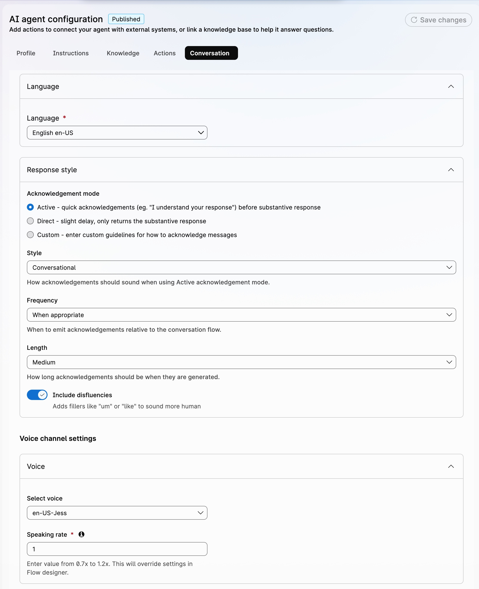

    The conversation tab tells your AI Agent how it should communicate with callers. Notice that there are a number of options which can control how tone, conversational style, language and voice. Two key settings you'll see in this section are the Language and Voice. These set the defaults for how the AI Agent will interact with callers. These also define the voice and language used when you test the AI Agent with the Preview feature.
    
    f. **Side Bar**
    
    So far, we have looked at the Configuration section. If you notice there are several other items in the side bar. While these are outside the scope of this class, we have included a list below of what each do.

    - Sessions: This section lists all of the sessions which have gone on with the agent. This section is useful for troubleshooting and understanding how each conversation happened.
    - History: This section shows the history of any commits to the AI Agent. Each time you make a change to the agent, you must save then publish the change

3. Review the **Demo Agent**.

    After you have reviewed the first AI Agent, select the Arrow at the top of the screen to return to list of AI Agents, then locate "Webex One Demo Agent".

    In this section we will call out some of the difference with this agent.

    a. **Profile Tab**
    
    You will see two differences in this AI Agent. 
        
    - The first is that AI transparency is disabled. This is because this will always be the second agent in the call flow so there is no reason to play this again.
    - The second is the introduction of variables in the Welcome message. Note that you see {{firstName}} in the welcome message, this lets us pass in a value from CVP that will be incorporated in the welcome message.

    b. **Instructions Tab**
        
    Note the differences from the Initial agent. You will see that it is much longer as this agent is a full AI Agent. Next, you will notice that there are comments included. These are shown with the ####preceding the line. You will also see a different Action used. Finally, note that we have included some information about the conversational style.

    c. **Knowledge Tab**
    
    You will see that we have mapped the Knowledge base to a working knowledge base for this AI Agent. 
    
    d. **Actions Tab**

    

    You will see that there are two actions which are enabled.

    - Agent handover: This is a default action which is used to handoff to a human agent. You can only enable or disable this action, it is not possible to edit or modify it.

    - TrackOrderStatus: This is a fulfillment action. Compare this to the action from the previous agent. Notice that there are instructions on how to handle the response back from fulfillment. In addition, notice that there is an additional section at the bottom of the form for where the fulfillment should be handled. In our case, we are letting the source flow (which is CVP for this lab) handle the fulfillment.


## **Task 2. Review and Update Call Studio**

Now that you've had a chance to look at the two AI Agents we'll use in this session, we'll now switch over to the On-Prem Contact Center side of this application. The Call Studio application that we are going to use is broken up into 3 pages.


1. Open **Call Studio**

    In this task, we'll switch over to the CCE side of the setup. We will work entirely in the CVP server for this. 

    !!! note "This is a non-standard setup"
        This is a special lab used for demonstrating concepts and features. It is not setup per Cisco best practices. One example of this is that Call Studio is installed on the CVP Call Server. In a customer environment, this should be installed separately.

    a. On **WKSTN1**, locate the mRemoteNG shortcut and double-click to open it. 
    
    

    b. In the list of servers, locate the _CVP_ Server and double-click to open it. Note, it may take up to a minute for this to login at times. On the server of CVP, locate _Cisco Unified Call Studio_ icon and double-click to open Call Studio. In the Project Explorer list, locate the NativeAI_Auto app, select the > symbol to expand the app, and finally double-click on the app.callflow to open the application we'll use in this lab.

    

    c. Take a moment to look at the application. As mentioned above, this is broken into 3 pieces one on each page, the Initial Greeting, Fulfillment Agent, and Return to CCE. Use the table to understand what each part done.

    | Page | Element | Description |
    |---------|---------|-------------|
    | Initial Greeting | Set Vars | This sets the default values for three variables which are used in the flow. <br /> • Agent - indicates if an Caller has requested a human agent<br /> • inError - Indicates an error occurred in the call<br /> • endSession - Indicates that the AI Agent was able to handle the call and no further escalation is required. |
    | Initial Greeting | InitialGreetingAgent | This VAV element sends the caller to the Webex One Initial Agent. |
    | Initial Greeting | ParseInitialReturn | This element is used to parse the JSON returned by the AI Agent and sets this into three variables |
    | Initial Greeting | CheckIfUserExists | This is the first SQL query and checks the database to see if the Student record has already been entered |
    | Initial Greeting | CheckResults | A Decision element which takes a different path based on the query results |
    | Initial Greeting | InsertNewUser | This is the second SQL query and inserts the record into the database if it was not found in the first element |
    | Initial Greeting | Fulfillment | This is a page connector and moves the flow to the next page in the application, Fulfillment Agent |
    | Initial Greeting | Error Message | In case an error occurs in the AI Agent, this plays a message to the caller |
    | Initial Greeting | SetAgentEscalate | Updates the Agent variable set in the Set Vars element to 'escalate' |
    | Initial Greeting | ReturnToCCE | This is a page connector and moves the flow the final page in the application, Return to CCE |
    | Fulfillment Agent | HeadsetAgent/ReturnToAgent | VAV Elements which invoke the second AI Agent in the call flow. The difference will be explained in this chapter |
    | Fulfillment Agent | HeadsetAgentDecision/HeadsetAgent2Decision | Decision Elements to handle the return from the AI Agent elements |
    | Fulfillment Agent | GetOrderValue | Parses the OrderID the customer provided and sets it to a variable |
    | Fulfillment Agent | GetOrderDetails | Calls the RESTful API to get the status of the customer's order |
    | Fulfillment Agent | ParseOrderDetails | Parses the return from the API and sets the value to a variable to pass back to the AI Agent |
    | Fulfillment Agent | setEndSession/SetAgent/SetError | Sets the variables from the initial part of this so that the Return to CCE knows what action to take |
    | Fulfillment Agent | FulfillmentErrHandler | In case an error occurs in the AI Agent, this plays a message to the caller |
    | Fulfillment Agent | ReturnToCCE | This is a page connector and moves the flow the final page in the application, Return to CCE |
    | Return to CCE | EvaluateReturn | Decision Element that direct the call based on the value of the variables set in the set elements |
    | Return to CCE | AgentHandoffFlag/SessionEndFlag/ErrorFlag | Flag elements to aid in troubleshooting and log review |
    
    How does the VAV element know which AI Agent to use? 
    
    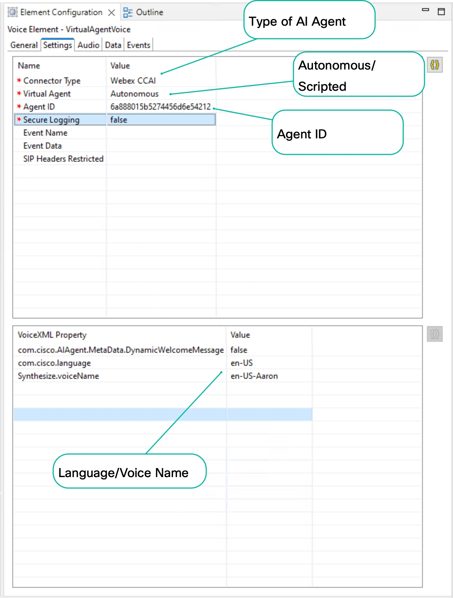{ width="500"}

    In this image, you see a few of the configuration items that help the VAV Element know which AI Agent it should call. In this section, only the first three settings are required, but we will see in the Fulfillment Agent page how we can use additional settings to make caller experience more complete.

    Where do we get the Agent ID to populate in the settings?

    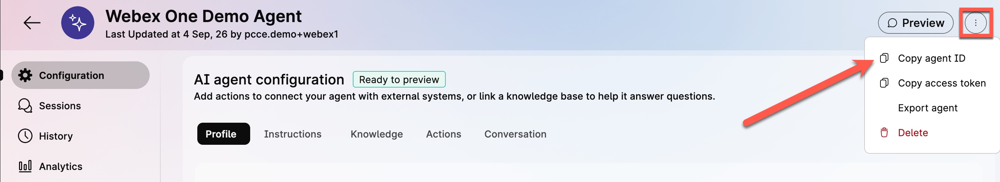

    In AI Agent Studio, you can copy the Agent ID that you will need.

2. Update **NativeAI_Auto** Application.

    a. On the Initial Greeting page, locate the ParseInitialReturn element. Select the Settings tab, then right-click in the grid and choose "Add Variable."

    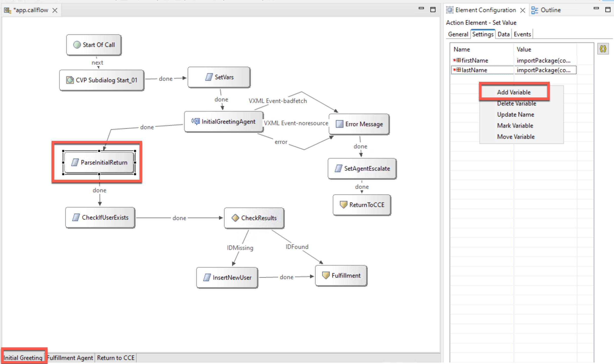

    b. In the Input Dialog, give the variable name: studentID.

    !!! warning "IMPORTANT - Case Matters!!"
        Ensure that you match the case exactly.

    Click on the ellipsis (3 dots) in the Value column next to the studentID variable you just created. 
    
    In the code box that pops up, paste the code below:

    ```text
    importPackage(com.audium.server.cvpUtil);

    var input = {Data.Element.InitialGreetingAgent.agent_handoff};

    // Cleanup the JSON
    var fixJSON1 = input.replace(/\\:/g,':');
    var fixJSON2 = fixJSON1.replace(/\\,/g,',');

    JSONPathUtil.eval(fixJSON2 , "\$.actions.CollectStudentInfo[0].input.stuID");
    ```

    Select the "Validate" button at the bottom of the code box and ensure that that you see Validation Successful.
    
    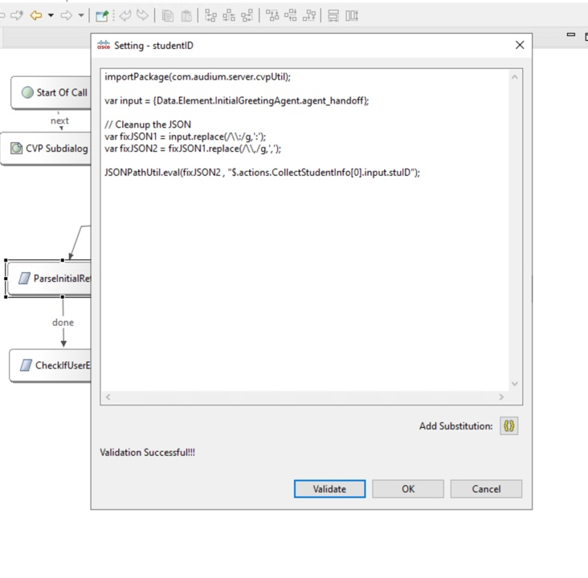{ width="500" }

    Click OK once everything looks correct.

    c. Next, select the tab labeled "Fulfillment Agent". In this section, we'll see a new feature which has been added in the latest ES(202607) called Exit and Re-Entry. First locate the HeadsetAgent VAV element and select it to review the options. 

    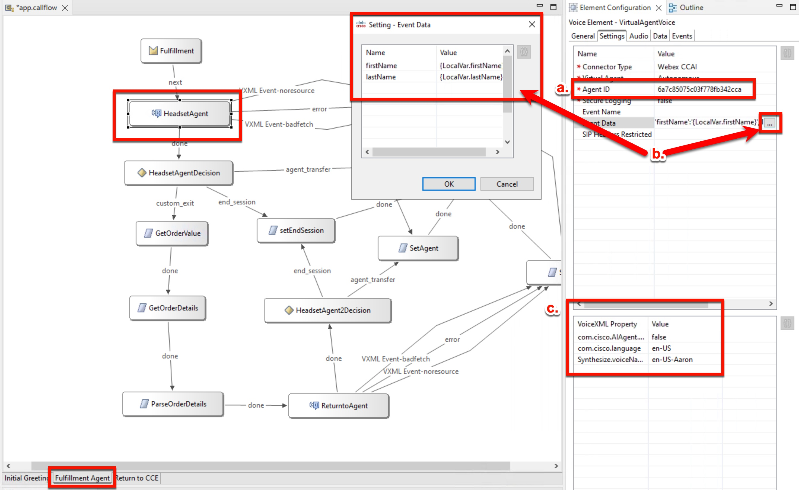

    Review the Settings tab and note a few key settings:
    
    * **Agent ID:** Notice this is a different ID than you saw in the Initial Greeting. This demonstrates Agent-to-Agent transfer where we are taking information collected in one AI Agent and passing it to a second.
    * **Event Data:** Click on the ellipsis and notice that we are sending the firstName and lastName we collected in the first AI Agent in as parameters to this AI Agent. This allows us to greet the customer by name.
    * **VoiceXML Properties:** Notice that we've set some options here. For now, just notice that we are setting the language and voiceName. If you remember up to the conversation tab explanation above, the language and voice was defined in the AI Agent. The settings shown in this section allow you to override these and the AI Agent will use the new settings.  If you want, feel free to update the Synthesize.voiceName to a different voice from the list below. 

        ??? note "List of Valid Voice Names"
            * en-US-Jess
            * en-US-Lisa
            * en-US-Mia
            * en-US-Frank
            * en-US-Chris
            * en-US-Aaron
            * en-US-Ava
            * en-US-Grace
            * en-US-Nora
            * en-US-Ethan
            * en-US-Wyatt

    d. Next, select the ReturnToAgent VAV Element. Here, we will configure the options that will ensure that the fulfillment is sent back to the same AI Agent. 

    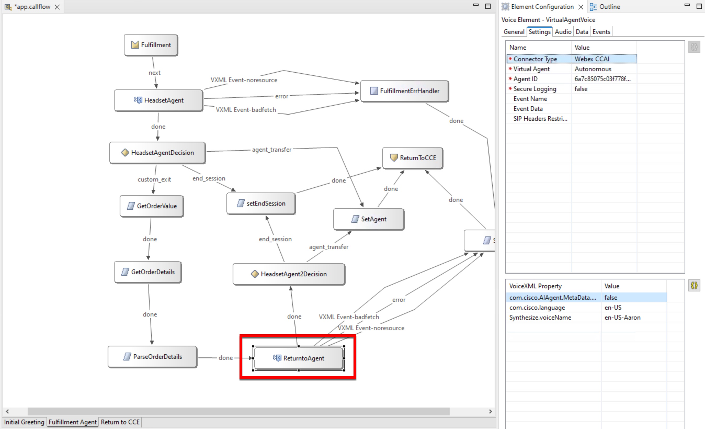

    If you remember from above, the Webex One Demo Agent has one custom action defined named "TrackOrderStatus". This collects the order ID from the customer, then returns this back to CVP. After we parse the data, we need to tell the AI Agent where it should resume processing. We do this by passing in the same Event Name that the AI Agent used to send us the fulfillment data.

    To update the application, make the following changes:

    - Event Name: Update this to be, TrackOrderStatus.
    - Event Data: To return the Order Results to the AI Agent, select the Ellipsis and in the settings box that pops up do the following:
        
        - Add a new parameter Name: orderResults
        - Click in the Value box and select the Golden Braces.  

            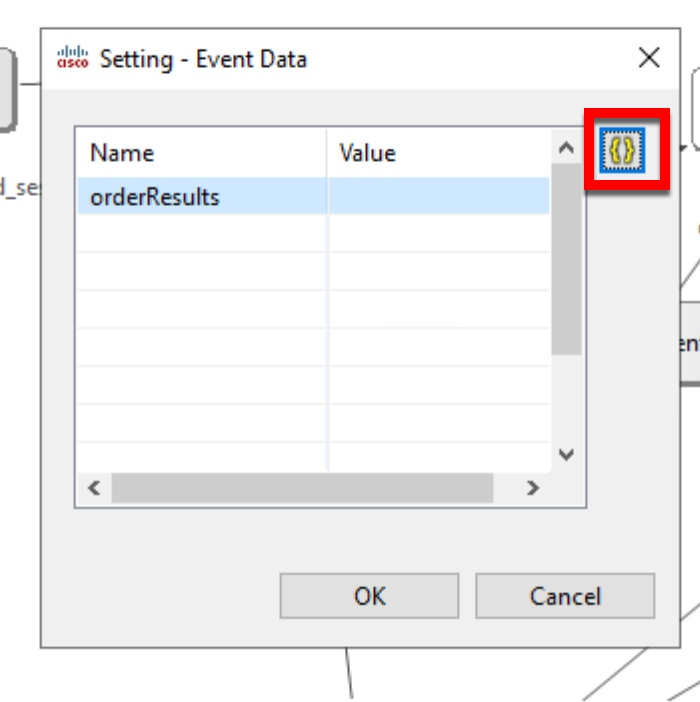{ width="300" }
            
            - Locate the Local Variable tab, then select the orderResults variable from the drop-down.
            - In the value box, enter a single quote, then select the "Add Tag" button, then add a second single quote. Compare the screenshot.
            
                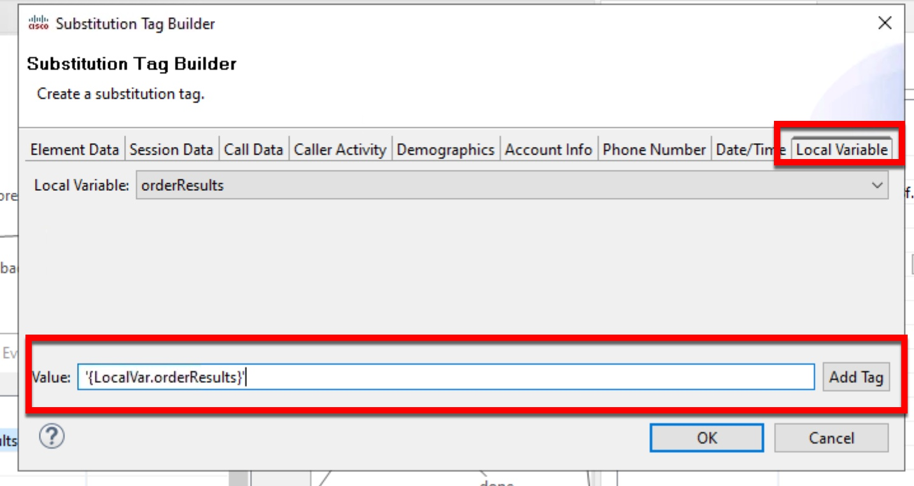{ width="500" }
            
            - Select OK.

        - Compare to the following screenshot, then select OK.

            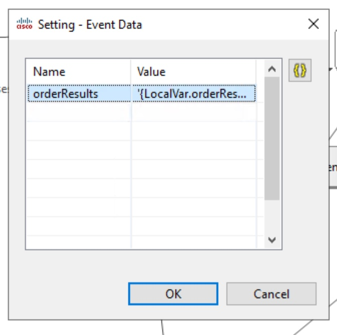{ width="300" }

    - VoiceXML Properties Updates

        - Update the com.cisco.AIAgent.MetaData.DynamicWelcomeMessage to be "true"
        - If desired, update the Synthesize.voiceName to match the voice name you chose in the first AI Agent.

            ??? note "Why did we update the DynamicWelcomeMessage"
                The new setting, com.cisco.AIAgent.MetaData.DynamicWelcomeMessage tells the AI Agent that it should not start with the old Welcome message. You could also pass in your own message in the Event Data if you wish, but here we will let the AI Agent handle the response.

            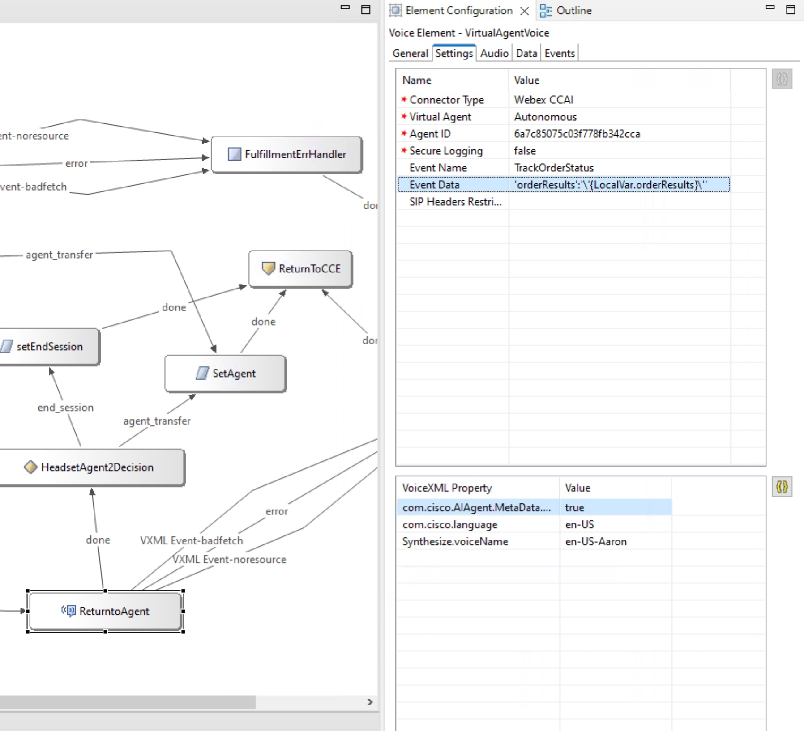

        Compare to the screenshot, when you are satisfied everything looks correct, proceed to the next step.
    
3. Deploy the **NativeAI_Auto** Application.

    - Save and Validate the App.

        1. Click on Save in the tool bar.

            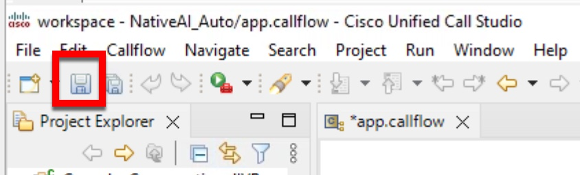{ width="500" }

        2. Right-click the application, then choose Validate and ensure no errors show. 

            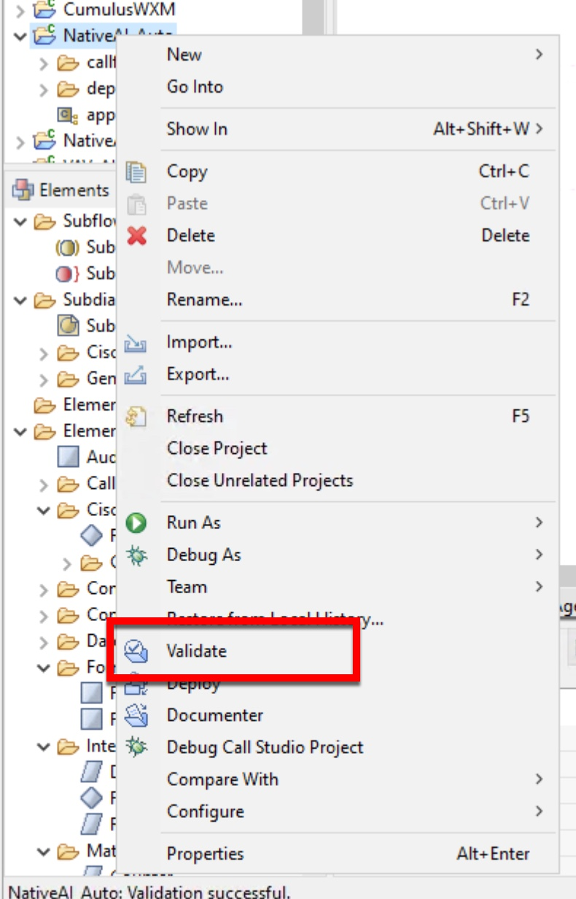{ width="300" }

    - Deploy and update the App.

        1. Right-click the application, then choose Deploy.

            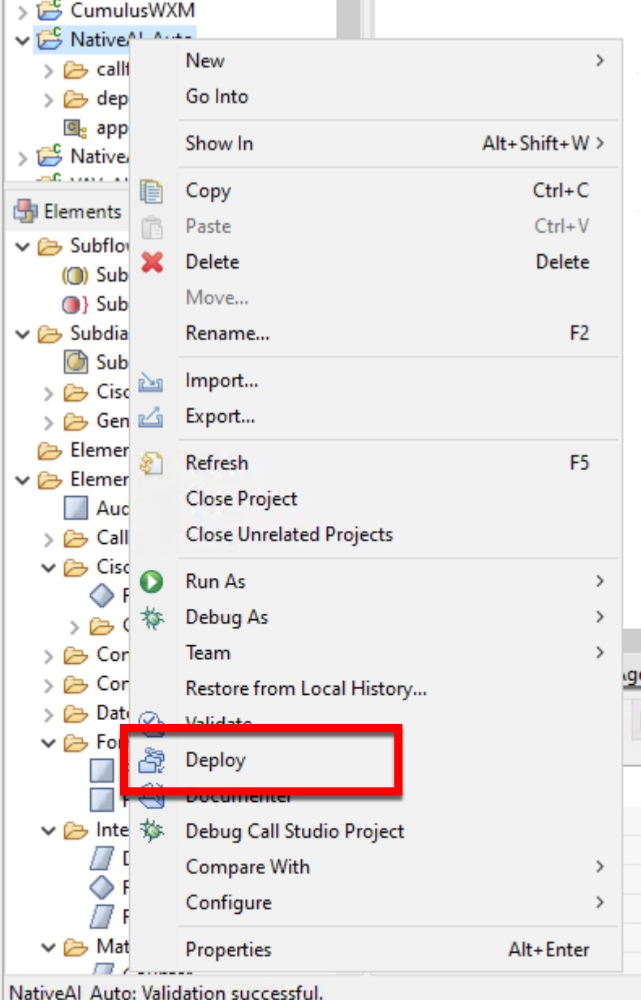{ width="300" }
        
        2. In the "Deploy Call Studio Project(s)" dialog, ensure that NativeAI_Auto application is selected and the Folder is set to "C:\Cisco\CVP\VXMLServer".
        
            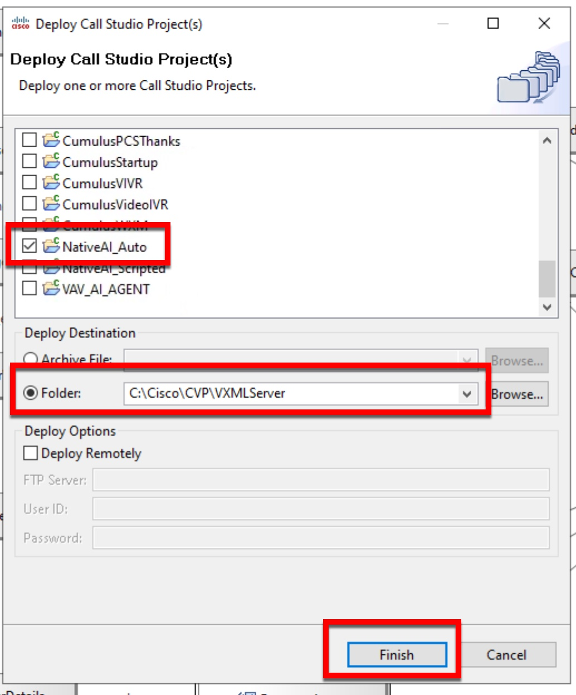{ width="300" }

        3. Click Finish when all looks correct.

4.  Deploy the **NativeAI_Auto** Application on VXML Server.

    - Minimize Call Studio. On the desktop of the Call Server, find the shortcut to "VXML Application" and double-click to open.

        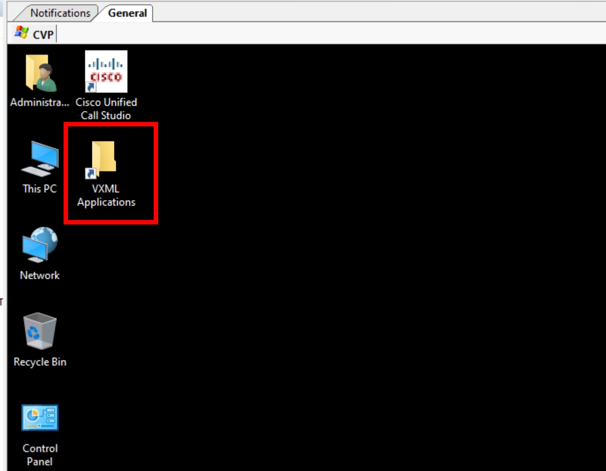{ width="500" }

    - Scroll down through the list of applications to find the folder labeled, *NativeAI_Auto*, then open this folder and navigate to the *admin* folder.

        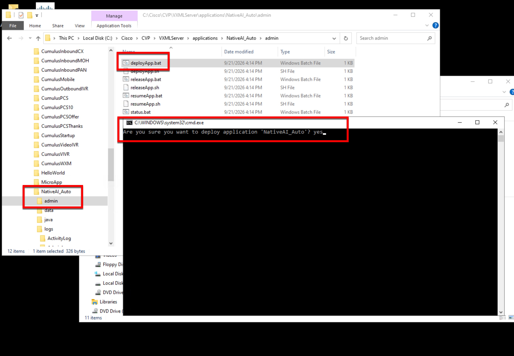{ width="750" }

    - Double-click on the *deployApp.bat* and answer "yes" in the command window.

    - Once you see the message that the application has been loaded and is running, hit *Enter* to close the box.

        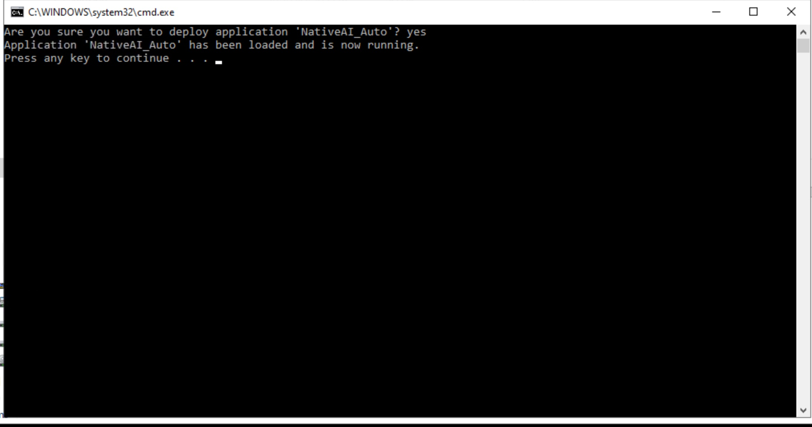{ width="500" }

## **Task 3. Test Call Flow**

In this task, you'll call into the AI agent and see how this works. 

| Note |
|---------|
| • Since this Lab is being conducted in a classroom, environmental factors like background noise and other attendees speaking next to you, may affect the response accuracy.<br>• For best results, it is strongly recommended to use computer headphones, if available. |

1. Use your mobile phone to call into the Main phone number for your session.

    a. On WKST1, open a browser and open a new tab. In the default page which appears, select **Demo Links** -> **Demo Website**. 

    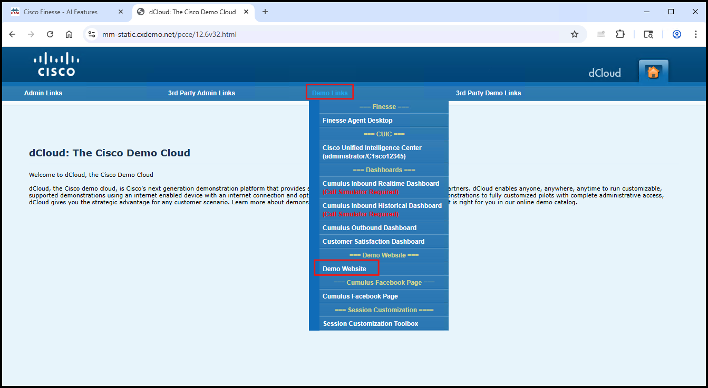

    b. In the **Cumulus Finance** website that is shown, select the blue box on the right-hand side that reads **Talk to an Expert**.

    

    c. In the box that pops out, select the **CallUs** link. In the box that pops up, note the **Main** number. This is what you will use to test your lab.

    - Use your mobile phone to call into the number.
    - You should hear the AI Agent greet you and request your Student ID and name.

    ***IMPORTANT: THE NUMBER SHOWN IN THE SCREENSHOT BELOW IS NOT THE NUMBER YOU WILL USE FOR YOUR LAB. ENSURE THAT YOU FIND THE NUMBER FOR YOUR SESSION!***

    

2. Suggested Call Flow

    a. You will be greeted by the Webex One Initial agent. The first thing you'll hear is the AI Transparency message. This will ask for your student ID, first name, and last name. Your Student Id will be the seat where you are at. 

    b. You will now be sent to the Webex One Demo agent. Here, you will hear the agent greet you by name. 

    c. Work with the knowledge base. You will find some suggested questions below but feel free to be creative. Try to get the agent to go outside of its guardrails.

    - Ask which headsets support bluetooth.
    - Ask which headsets have boom mics.
    - Ask what the weather is in Austin today.

    d. After exploring the knowledge base, ask to track an order. When the agent asks you for an order ID, give it any sequence of digits.

    This illustrates a new capability for autonomous AI Agent. The AI Agent session is paused and the the data collected is returned back to the calling flow, in this case, the CVP Call Studio app. The calling flow can now process this information and send the results back to the AI Agent.

    ??? question "What if I have more than one action in my AI Agent?"

        If you remember when we walked through the application, we showed the Event Name setting in the AI Agent.  This must be set to the same names as the Action Name which handed off to the studio app. This way, the AI Agent knows which Action was used to exit the app and where it should pick back up with all the original context.
    
    e. Once you have tested the call flow, you can hang up at this time. We will call back later in this lab and see the handoff to a Finesse agent.

 <p align="center"><strong>This now completes Lab 1!</strong></p>   