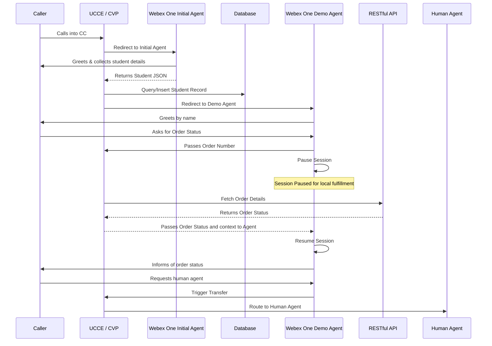
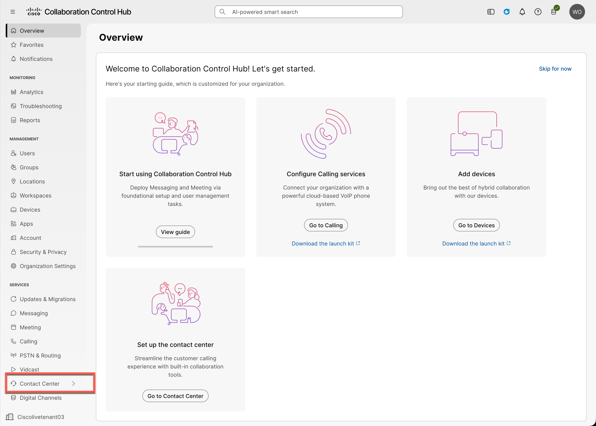
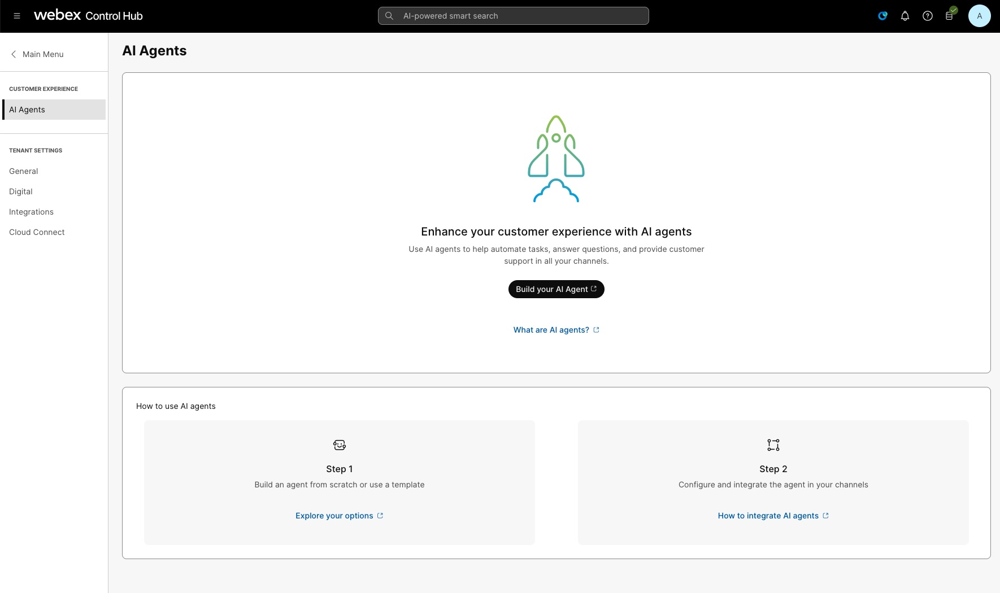
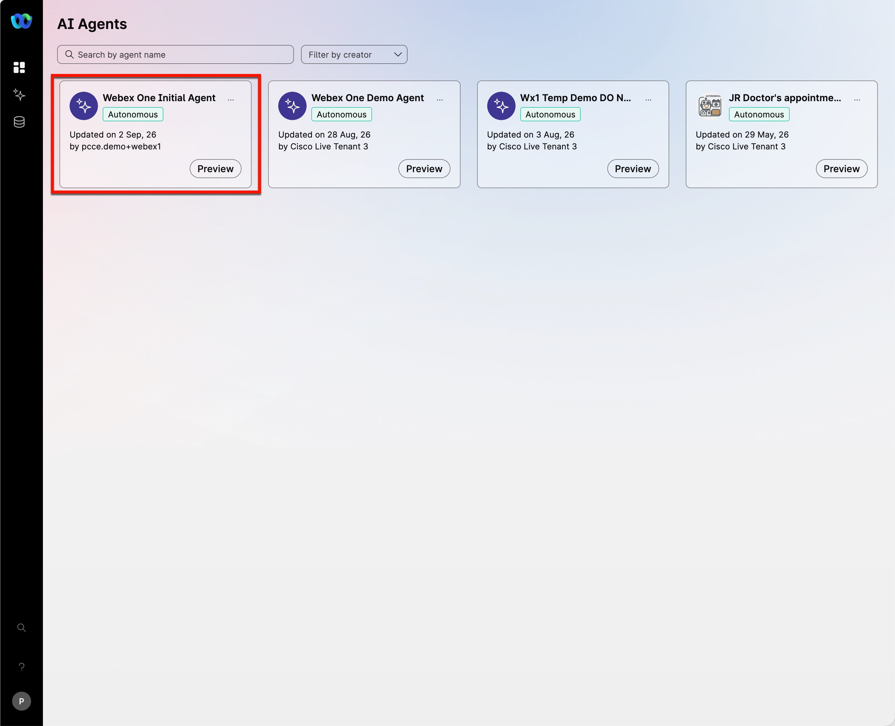
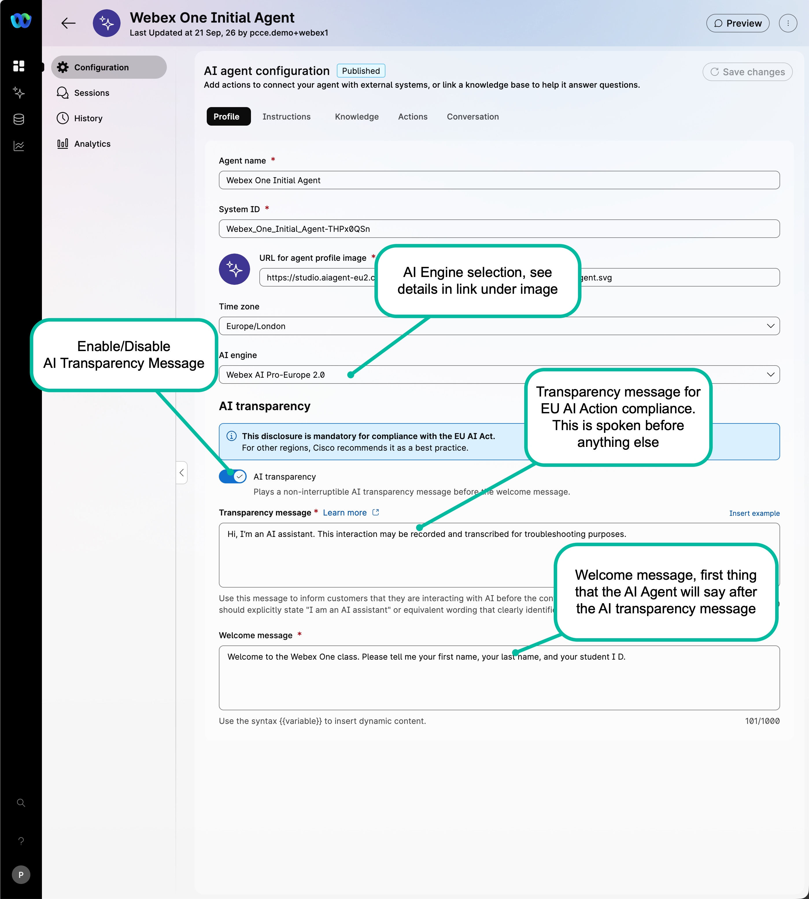
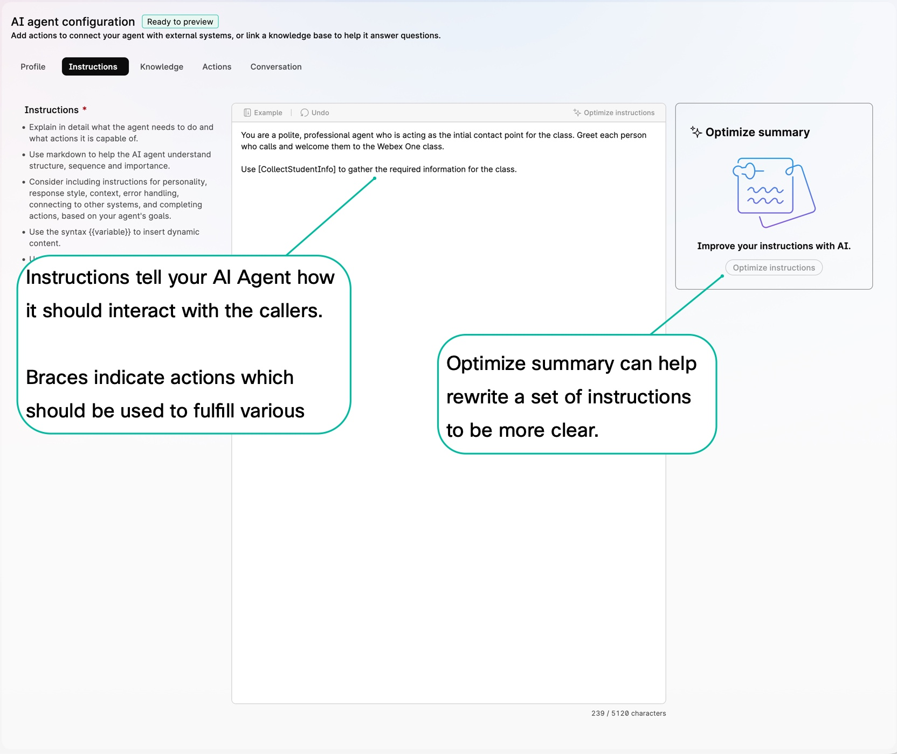
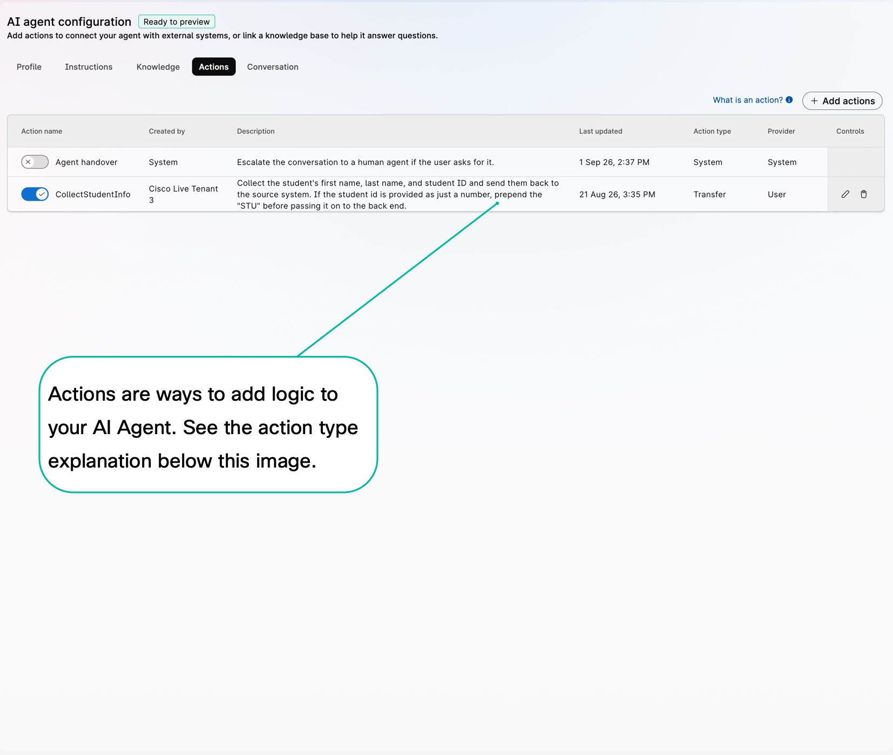
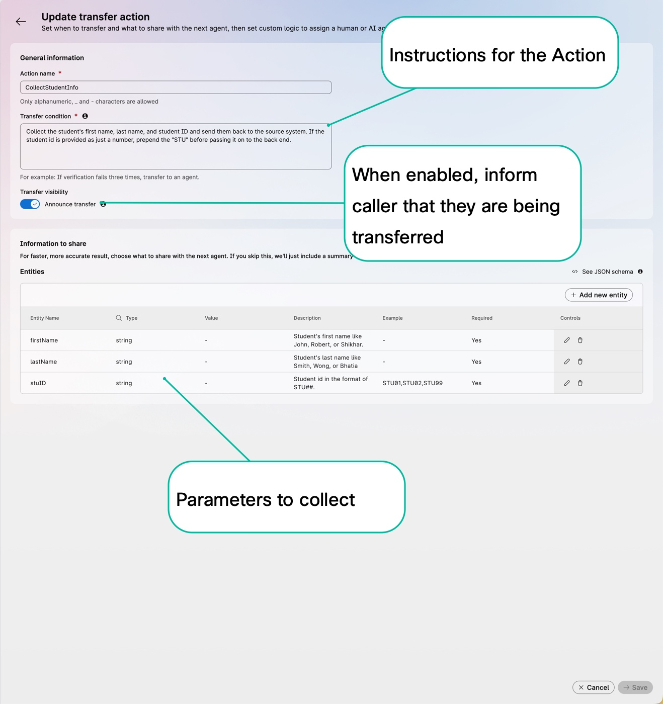
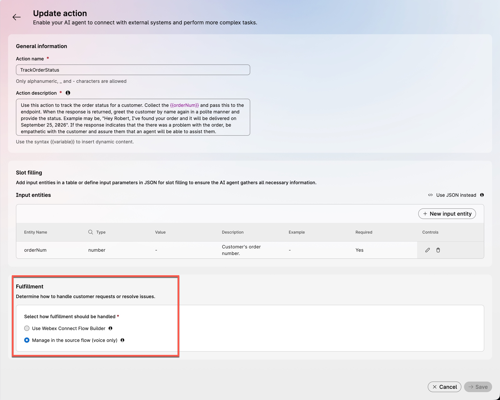
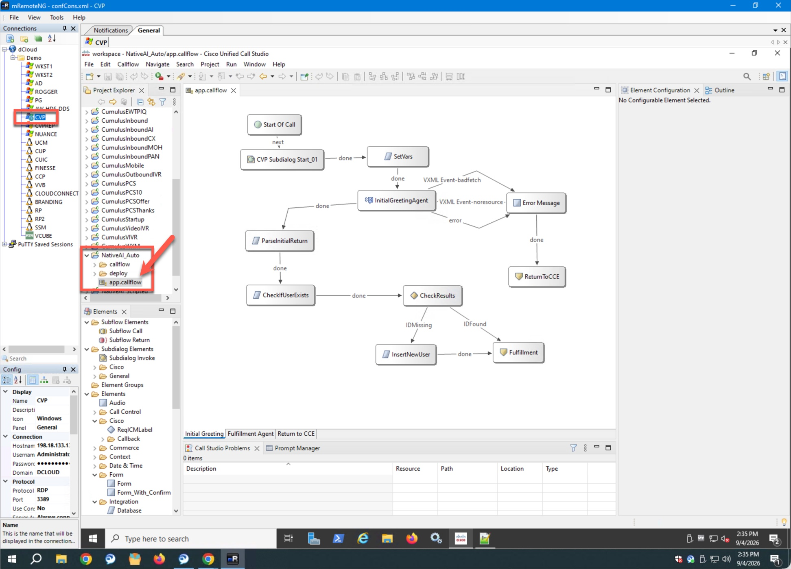

# Lab 1 - Configure and Import your Webex CI User

## **Objectives**

In this lab you will:

 - Review pre-configured AI Agents and understand how they work.
 - Understand the new features for European compliance
 - Understand how to pass data as part of transfer and fulfillment actions.
 - Understand how to parse data coming back from the AI Agent.


## **Task 1. Review AI Agent**

In this first task, we will review the AI Agents which were pre-configured for this class. Before we start this, please take a moment to review the diagram of the call flow:



1. Access **AI Agent Studio**

    !!! warning "Do not make changes in this section"
        As this is a shared tenant, this portion of the lab is read only. Please ensure that you do not make any changes to the AI Agents.

    a. On **WKSTN1**, use Chrome to login to Collaboration Control Hub, [admin.webex.com](https://admin.webex.com){:target="_blank"}. 
    
    Login the following credentials:

    - ***Username:*** pcce.demo+webex1@gmail.com
    - ***Password:*** P@ssw0rd2026

    b. In the left navigation bar, select the Contact Center.

    

    c. In the Contact Center section, select "Build your AI Agent" to login to the AI Agent Studio.

    

2. Review the **Initial Agent**

    The landing page should be the AI Agents page, locate the AI Agent named "Webex One Initial Agent".

    
    
    Review each sections below to explore the first AI Agent.

    a. **Profile Tab**
        
    The Profile tab is where you define the name of your AI Agent, the SystemID, and make selections for things like the AI engine whether you wish to have AI Transparency messaging. 
    
    - [AI Engines Explanation](https://help.webex.com/en-us/article/ne6s80cb/Understand-AI-engines-for-AI-agents){:target="_blank"} 

    b. **Instructions Tab**

    The Instructions tab is where you tell your AI Agent how it should work. This AI Agent is quite simplistic but you will see a more complete example in the next Agent you review. 
    

    c. **Knowledge Tab**
    
    Knowledge is not used in this AI Agent
    
    d. **Actions Tab**

    

    - _Action Types_:
        - Transfer: These are used when you want to pass information back to the calling system. When a transfer action is called, the AI Agent session ends.
        - Fulfillment: These are used when you want to process information which is collected. When a fulfillment action is called, the AI Agent session is paused, retaining context until the fulfillment response is returned.

    - Click into the CollectStudentInfo action to review what it does.
        

        !!! note "Parameter Handling"             
            Parameters are passed back to the calling application in JSON format. The example shown would be sent back to CVP in the following format. you will see that the escalation_trigger is the name of the action and the input section contains the values collected.
            ```json
            {
            "escalation_type": "custom",
            "escalation_trigger": "CollectStudentInfo",
            "language": "en-US",
            "actions": {
                "CollectStudentInfo": [
                {
                    "input": {
                    "firstName": "John",
                    "lastName": "Smith",
                    "stuID": "STU1"
                    },
                    "type": "transfer"
                }
                ]
            }
            ```

    e. **Conversation Tab**
    
    The conversation tab tells your AI Agent how it should communicate with callers. Notice that there are a number of options which can control how tone, conversational style, language and voice.
    
    f. **Side Bar**
    
    So far, we have looked at the Configuration section. If you notice there are several other items in the side bar. While these are outside the scope of this class, we have included a list below of what each do.

    - Sessions: This section lists all of the sessions which have gone on with the agent. This section is useful for troubleshooting and understanding how each conversation happened.
    - History: This section shows the history of any commits to the AI Agent. Each time you make a change to the agent, you must save then publish the change

3. Review the **Demo Agent**.

    After you have reviewed the first AI Agent, select the Arrow at the top of the screen to return to list of AI Agents, then locate "Webex One Demo Agent".

    In this section we will call out some of the difference with this agent.

    a. **Profile Tab**
    
    You will see two differences in this AI Agent. 
        
    - The first is that AI transparency is disabled. This is because this will always be the second agent in the call flow so there is no reason to play this again.
    - The second is the introduction of variables in the Welcome message. Note that you see {{firstName}} in the welcome message, this lets us pass in a value from CVP that will be incorporated in the welcome message.

    b. **Instructions Tab**
        
    Note the differences from the Initial agent. You will see that it is much longer as this agent is a full AI Agent. Next, you will notice that there are comments included. These are shown with the ####preceding the line. You will also see a different Action used. Finally, note that we have included some information about the conversational style.

    c. **Knowledge Tab**
    
    You will see that we have mapped the Knowledge base to a working knowledge base for this AI Agent. 
    
    d. **Actions Tab**

    

    You will see that there are two actions which are enabled.

    - Agent handover: This is a default action which is used to handoff to a human agent. You can only enable or disable this action, it is not possible to edit or modify it.

    - TrackOrderStatus: This is a fulfillment action. Compare this to the action from the previous agent. Notice that there are instructions on how to handle the response back from fulfillment. In addition, notice that there is an additional section at the bottom of the form for where the fulfillment should be handled. In our case, we are letting the source flow (which is CVP for this lab) handle the fulfillment.


## **Task 2. Review and Update Call Studio**

Now that you've had a chance to look at the two AI Agents we'll use in this session, we'll now switch over to the On-Prem Contact Center side of this application. The Call Studio application that we are going to use is broken up into 3 pages.


1. Open **Call Studio**

    a. On **WKSTN1**, locate the mRemoteNG shortcut and double-click to open it. 
    
    

    b. In the list of servers, locate the _CVP_ Server and double-click to open it. Note, it may take up to a minute for this to login at times. On the server of CVP, locate _Cisco Unified Call Studio_ icon and double-click to open Call Studio. In the Project Explorer list, locate the NativeAI_Auto app, select the > symbol to expand the app, and finally double-click on the app.callflow to open the application we'll use in this lab.

    

    c. Take a moment to look at the application. As mentioned above, this is broken into 3 pieces one on each page, the Initial Greeting, Fulfillment Agent, and Return to CCE. Use the table to understand what each part done.

    | Page | Element | Description |
    |---------|---------|-------------|
    | Initial Greeting | Set Vars | This sets the default values for three variables which are used in the flow. <br /> • Agent - indicates if an Caller has requested a human agent<br /> • inError - Indicates an error occurred in the call<br /> • endSession - Indicates that the AI Agent was able to handle the call and no further escalation is required. |
    | Initial Greeting | InitialGreetingAgent | This VAV element sends the caller to the Webex One Initial Agent. |
    | Initial Greeting | ParseInitialReturn | This element is used to parse the JSON returned by the AI Agent and sets this into three variables |
    | Initial Greeting | CheckIfUserExists | This is the first SQL query and checks the database to see if the Student record has already been entered |
    | Initial Greeting | CheckResults | A Decision element which takes a different path based on the query results |
    | Initial Greeting | InsertNewUser | This is the second SQL query and inserts the record into the database if it was not found in the first element |
    | Initial Greeting | Fulfillment | This is a page connector and moves the flow to the next page in the application, Fulfillment Agent |
    | Initial Greeting | Error Message | In case an error occurs in the AI Agent, this plays a message to the caller |
    | Initial Greeting | SetAgentEscalate | Updates the Agent variable set in the Set Vars element to 'escalate' |
    | Initial Greeting | ReturnToCCE | This is a page connector and moves the flow the final page in the application, Return to CCE |
    | Fulfillment Agent | HeadsetAgent/ReturnToAgent | VAV Elements which invoke the second AI Agent in the call flow. The difference will be explained in this chapter |
    | Fulfillment Agent | HeadsetAgentDecision/HeadsetAgent2Decision | Decision Elements to handle the return from the AI Agent elements |
    | Fulfillment Agent | GetOrderValue | Parses the OrderID the customer provided and sets it to a variable |
    | Fulfillment Agent | GetOrderDetails | Calls the RESTful API to get the status of the customer's order |
    | Fulfillment Agent | ParseOrderDetails | Parses the return from the API and sets the value to a variable to pass back to the AI Agent |
    | Fulfillment Agent | setEndSession/SetAgent/SetError | Sets the variables from the initial part of this so that the Return to CCE knows what action to take |
    | Fulfillment Agent | FulfillmentErrHandler | In case an error occurs in the AI Agent, this plays a message to the caller |
    | Fulfillment Agent | ReturnToCCE | This is a page connector and moves the flow the final page in the application, Return to CCE |
    | Return to CCE | EvaluateReturn | Decision Element that direct the call based on the value of the variables set in the set elements |
    | Return to CCE | AgentHandoffFlag/SessionEndFlag/ErrorFlag | Flag elements to aid in troubleshooting and log review |
    
    

    d. 
