# Lab 2 - Configure and Import your Webex CI User

## **Objectives**

In this lab you will:

 - Know how to create a user on Control Hub and add them to the PCCE synced Group.
 - Know how to configure your PCCE deployment for periodic/manual sync with the Control Hub
 - Know how to import users into CCE as Webex CI users.
 - Know how to configure an imported Webex CI user as an Agent on CCE.

??? question "What are the prerequisites for Webex Common Identity(CI)?"

     - Install ICM_ES202511 or later.
     - Order for Webex Common Identity is placed on Cisco Commerce Workspace (CCW).
     - Install Cloud Connect ES202511 COP or later.
     - Cloud Connect is added to Inventory and registered on Webex Control Hub.
     - Install Cisco Finesse 15.0(1) SU1 or later.
     - Webex CI endpoints is enabled in your proxy settings. See [CCE 15.0 Security Guide](https://www.cisco.com/c/en/us/support/customer-collaboration/unified-contact-center-enterprise/products-installation-and-configuration-guides-list.html){:target="_blank"}.

## **Task 1. Create users on Webex Control Hub**

**Step 1:**
On **WKSTN1**, using Chrome log into **Webex Control Hub** - [admin.webex.com](https://admin.webex.com){:target="_blank"} - using the credentials below:

 - ***Username:*** CiscoWxConnect2+tenant03@gmail.com
 - ***Password:*** CXNativeAI2025!

   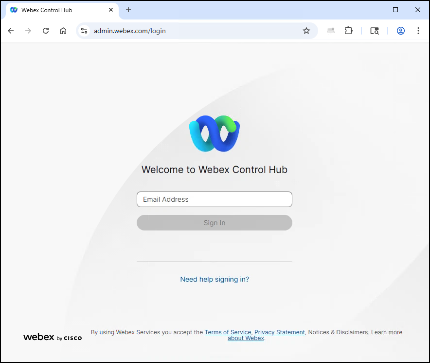

**Step 2:**  Read Only
From the left-side menu, navigate to **Users** -> and click on the **Add Users** button.

   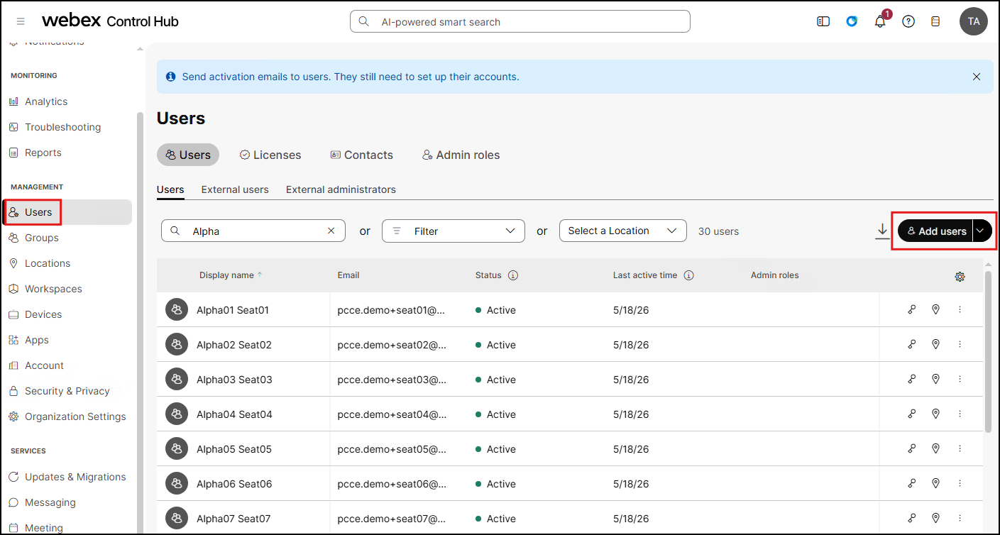

**Step 3:**  Read Only
Enter in the **First Name**, **Last Name**, **Email Address** and then click **Next**.
***Note:*** *You cannot add existing users in your organization or users that already have a Webex account.*

   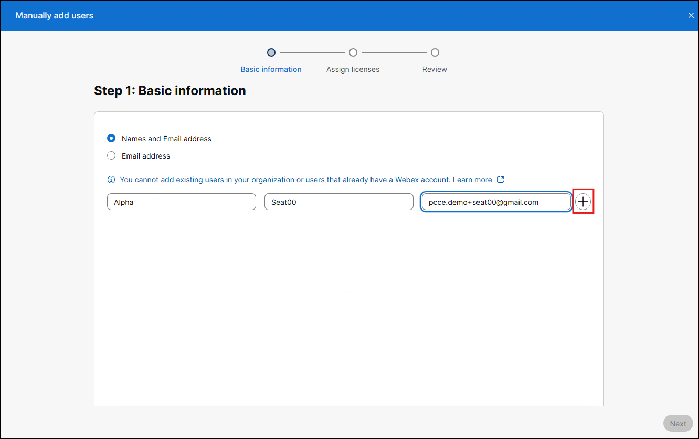

**Step 4:**  Read Only
Click Next in the **Assign license for users** page 

   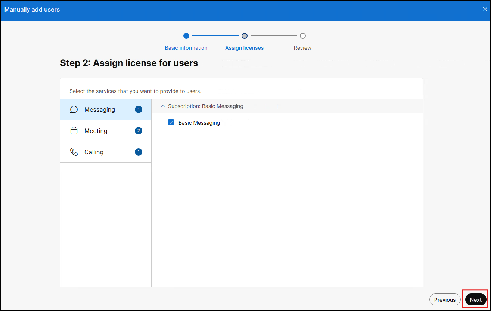

**Step 5:**  Read Only
In the **Review** page, review the details and click the **Add Users** button.
At this point the User is successfully created on Control Hub with a status of **Not Verified**.

   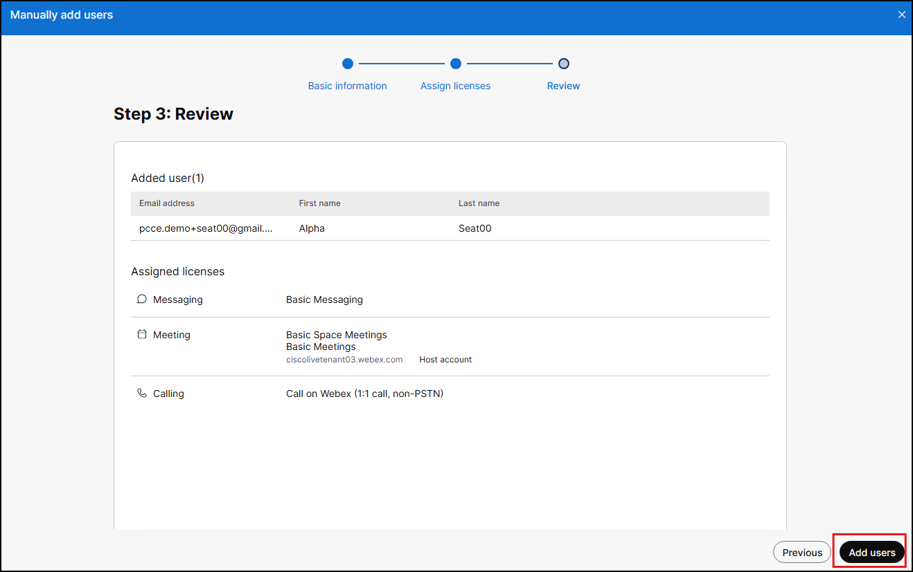
   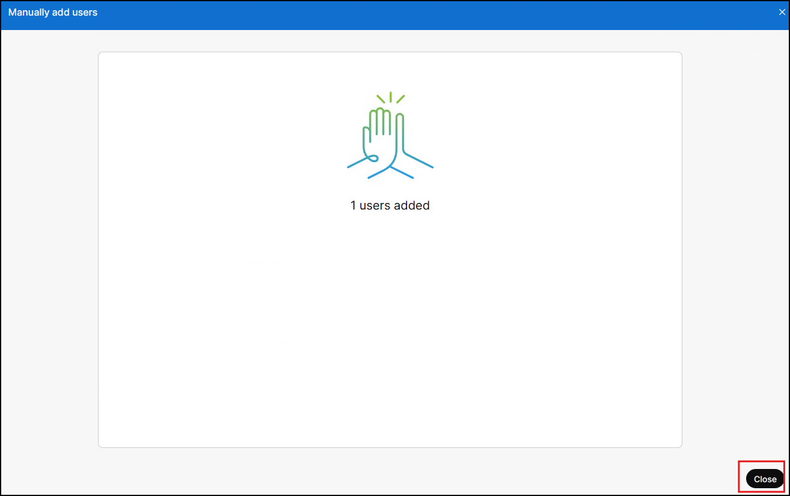
   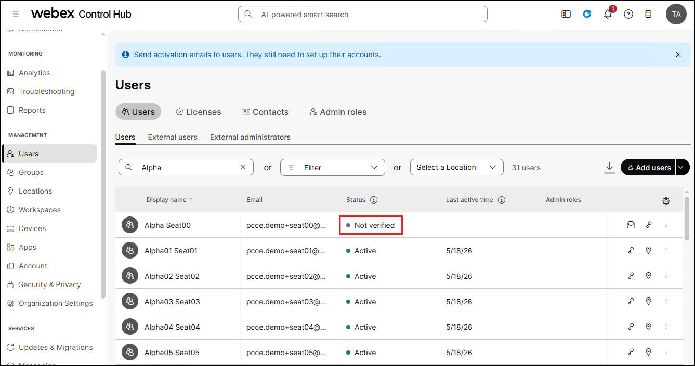

**Step 6:**  Read Only
Verify the user using the **Activation email** sent to the email id entered and set the password.
The status on Control Hub will now show **Active** for the user account added.

   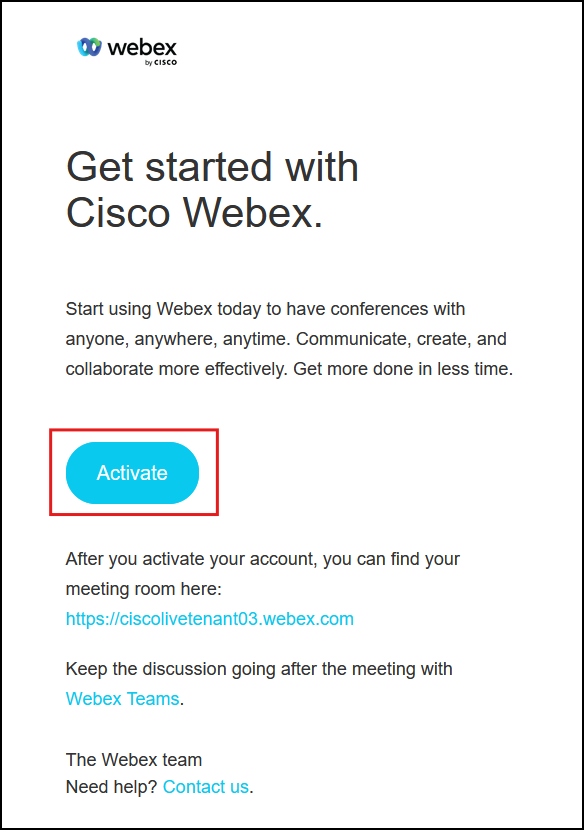{ width="50%" height="50%" }
   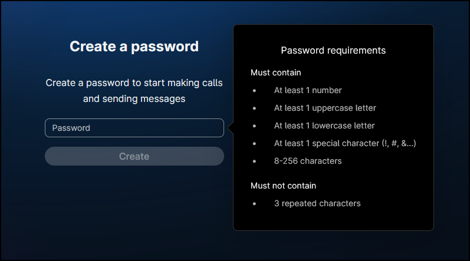{ width="50%" height="50%" }
   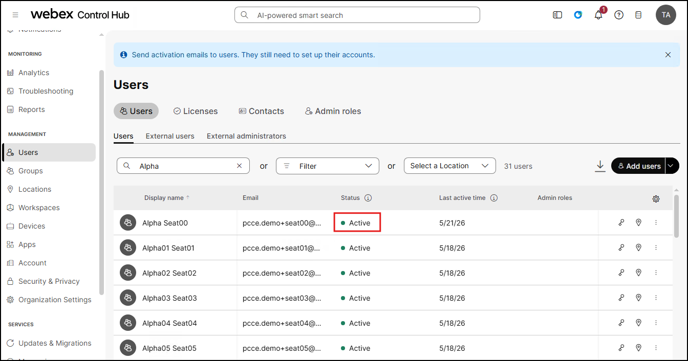

**Step 7:**  Read Only
Click on the created user account on Control Hub; and under the **Summary** tab, find the **Groups** section and click on **Add to Webex groups**.

   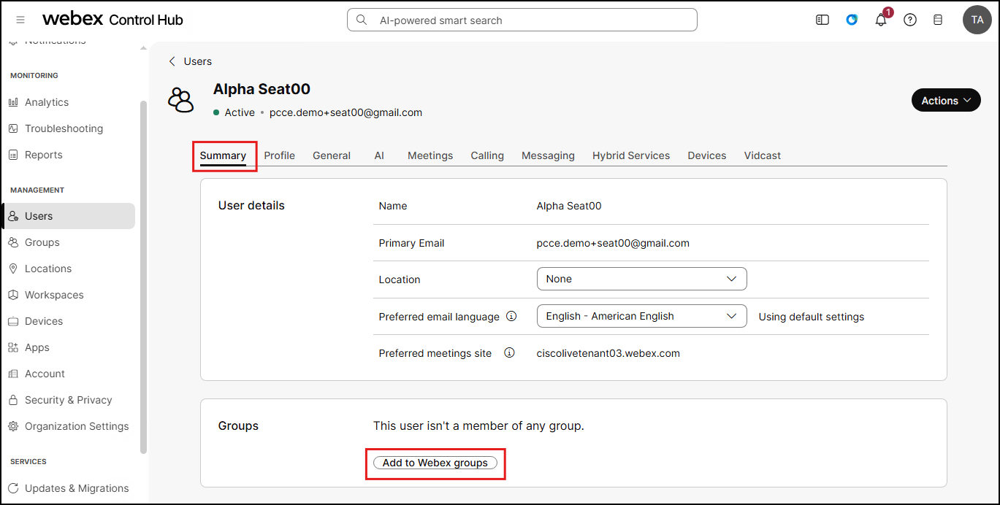

**Step 8:**  Read Only
Next, select **PCCE Users** group -> **Save**.

??? question "What are these Webex groups seen in the drop-down?"

    • When an Org is created in a PCCE solution, a **PCCE Users** group is created automatically by the System.
    • When an Org is created in a UCCE solution, a **UCCE Users** group is created automatically by the System.
    • Similarly, for a WxCCE solution, a **WxCCE Users** group is created automatically by the System.

   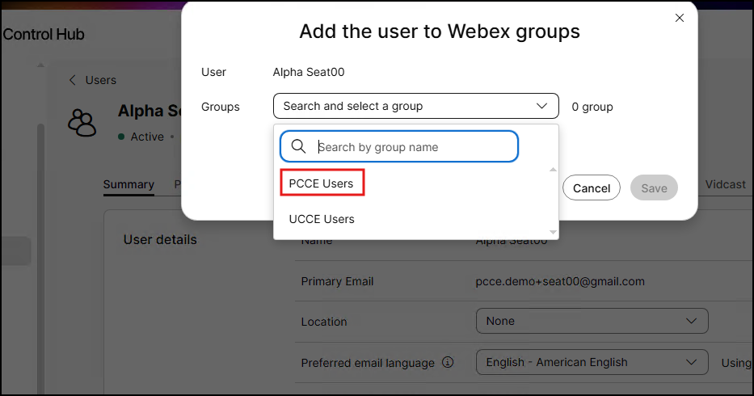
   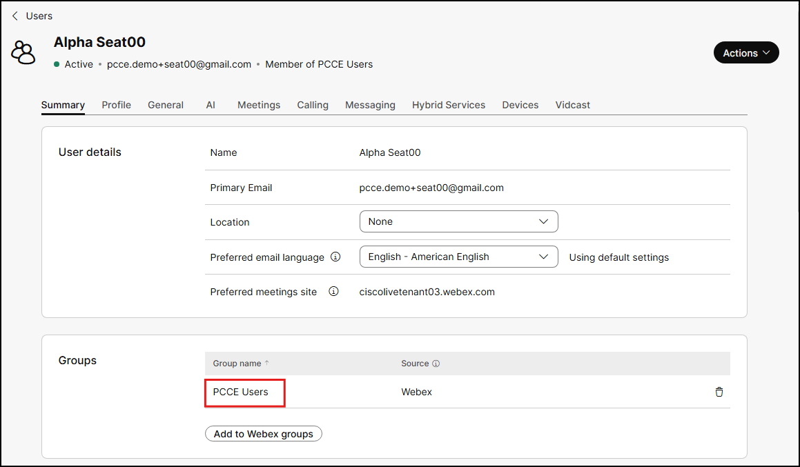

## **Task 2. Import Users into CCE**

**Step 1:**
On WKSTN1, using Chrome log into the **CCEAdmin** page - [ccedata.dcloud.cisco.com/cceadmin](https://ccedata.dcloud.cisco.com/cceadmin){:target="_blank"} - using the credentials below.

 - ***Username:*** administrator@dcloud.cisco.com
 - ***Password:*** C1sco12345

   

**Step 2:**  Read Only
Navigate to **Features** -> **Single Sign-On** -> click on the **Webex Common Identity** tab.Under the **Configuration** tab, you have option to enable auto-sync and/or perform a manual sync on demand.

 - Using the **Auto/Periodic Sync** or the **Manual Sync**, the users created on Control Hub & added to the **PCCE Users** group will be imported into CCE.

   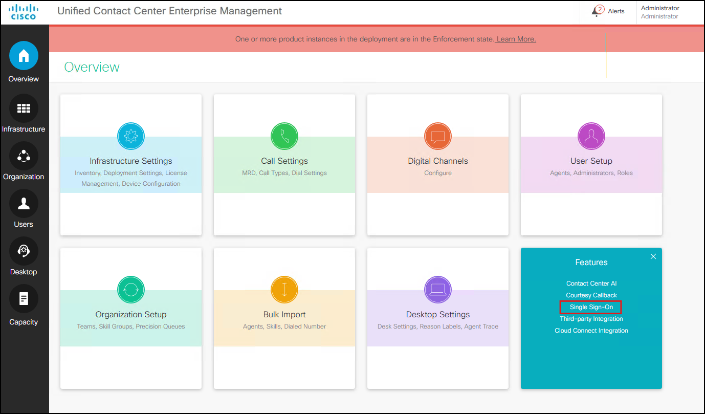
   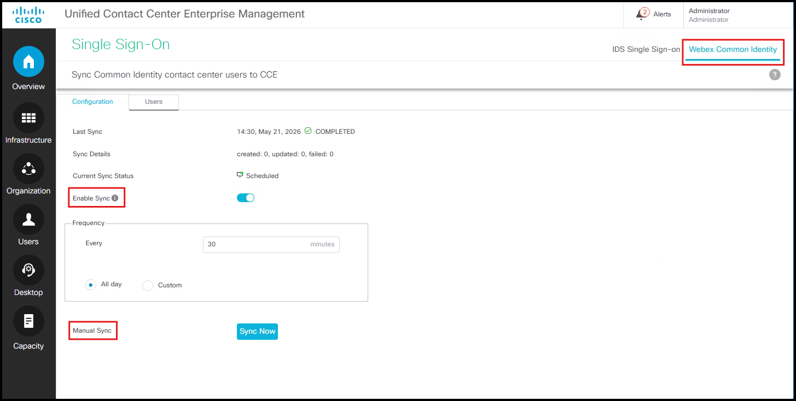

??? note "Webex CI Configuration Fields and their descriptions"

    **Last Sync:** Displays the timestamp of the latest sync and sync completion status.
    
    
    **Sync Details:** Displays number of Webex CI users synced from Common Identity to the CCE database.
    - **Created:** Number of newly synced Webex CI users.
    - **Updated:** Number of existing Webex CI users whose information is updated.
    - **Failed:** Number of Webex CI users that failed to sync. You can click “Failed” to see the list of failed users that are not synced to the CCE database.
    
    
    **Current Sync Status:** Displays the sync status, whether the sync is in progress or scheduled.
    
    
    **Enable Sync:** Switch the toggle ON to enable Periodic / Auto sync. To disable Periodic / Auto sync, toggle this option OFF.
    
    
    **Frequency:** Displays the defined timestamp at which the Webex CI users sync must occur. 30mins is the default timestamp.
    - **All day:** Select the All day radio button to sync users every day.
    - **Custom:** Select the Custom radio button to sync users based on the required start and end time on the From and To fields.
    
    
    **Manual Sync:** Click ***Sync Now*** to trigger the manual sync process. This can be triggered at any point when the ***Enable Sync*** option is enabled. 
    
    
    **NOTE:** ***Sync Now*** button is available only when ***Enable Sync*** button is turned ON. Manual Sync is disabled during an active automatic sync.

**Step 3:**  Read Only
To view the list of users successfully imported, click on the **Users** tab.

   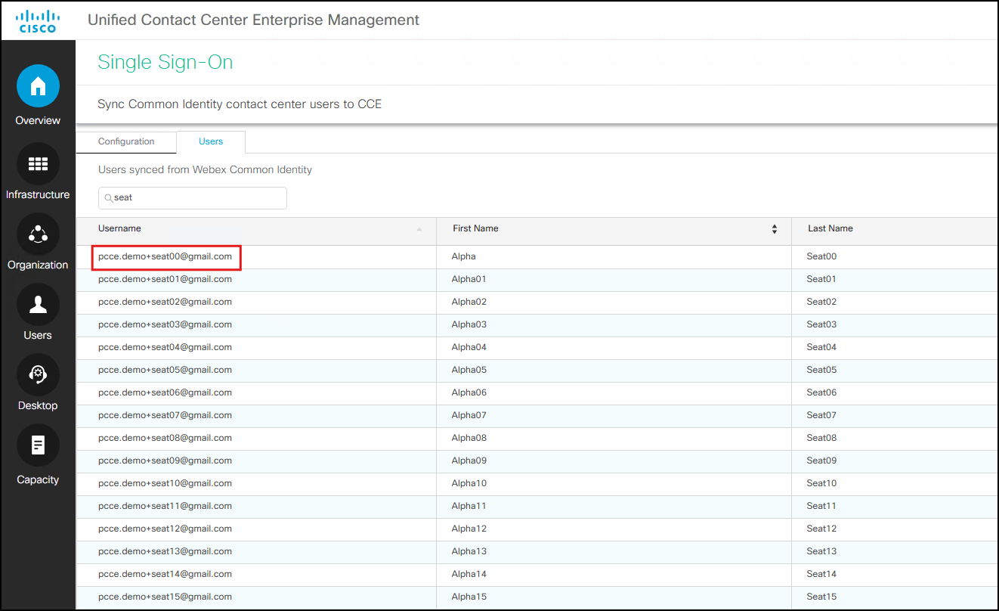

## **Task 3. Configure the imported Users as Agents in CCE**

**Step 1:**
Now, navigate to **Users** -> **Agents** and click on the **New** button to add the imported user as an Agent on CCE.

   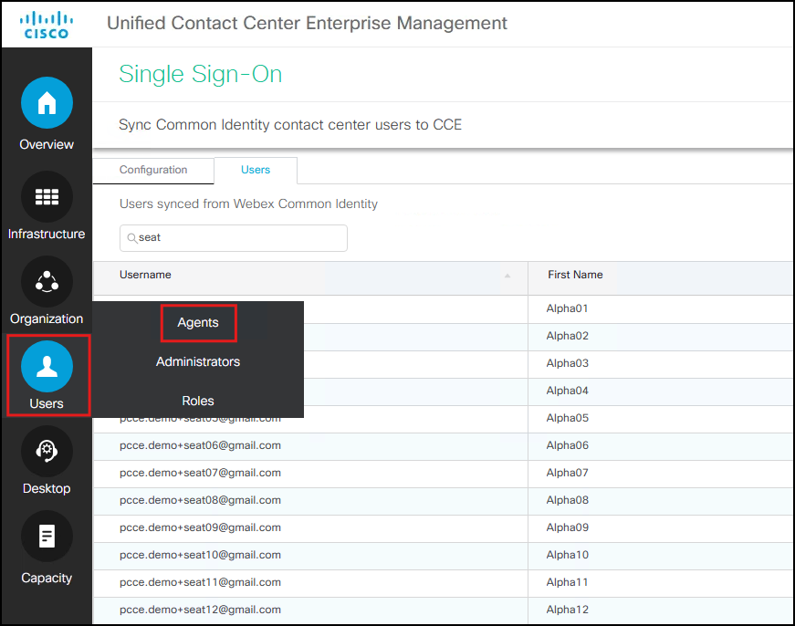

**Step 2:**
On the New Agent configuration page:

a. Uncheck the **Set Password** option.
Note: Ensure to clear out the Auto-Filled entries.

b. Check the **Enable SSO** box and select **Webex Common Identity** radio button.

c. Search for your Agent name - *in this case, enter your seat number - example seat00*.

 - This will then auto populate the **Username**, **First Name** and **Last Name** fields.

   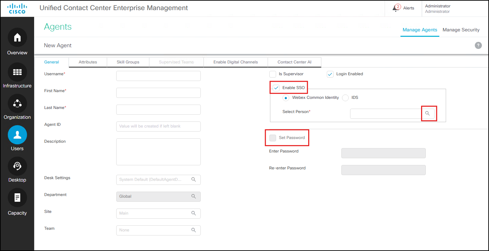
   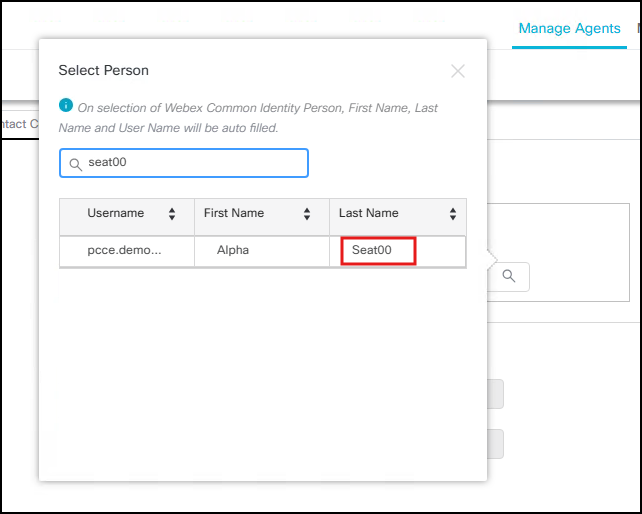

d. Next, assign the agent to the **Webex_AI_Team** team.

e. Set the Desk Settings as **UWFDeskSettings**.

   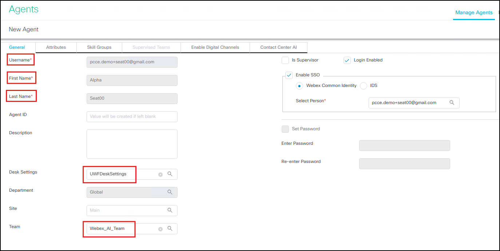

f. Under the **Attributes** tab, add the attribute **CumulusInbound** and set the value as 5 or higher.

   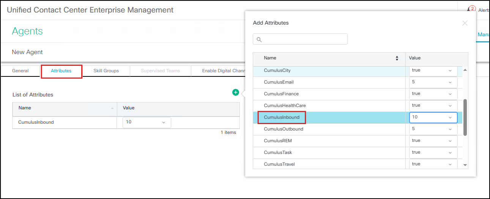

g. Now, click the **Contact Center AI** tab and select the following features and the click **Save**.

 - Virtual Agent Transcript
 - Call transcript
 - Virtual agent transfer summaries
 - Real-time Assist
 - Wrap-up summaries 

   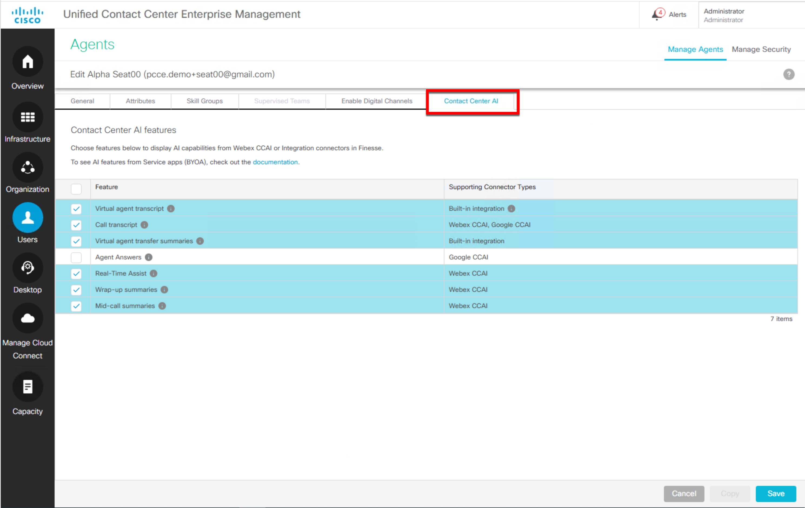

## **Task 4. Review Agent Desk Setting and assign Wrap-Up reason to the Agent Team**

??? question "What's the purpose of this task?"

     - Wrap-up Summary requires Wrap-up to be set to **Required** or **Required with wrap-up data**.
     - When Wrap-up is set to Required or Required with wrap-up data, at least 1 wrap-up reason must be assigned to the team.

**Step 1:**
Navigate to **Desktop** -> **Desk Settings** -> Select the Desk Setting **UWFDeskSettings**

 - Ensure the parameters **Wrap-up on Incoming** and **Wrap-up on Outgoing** are both set to **Required**.

   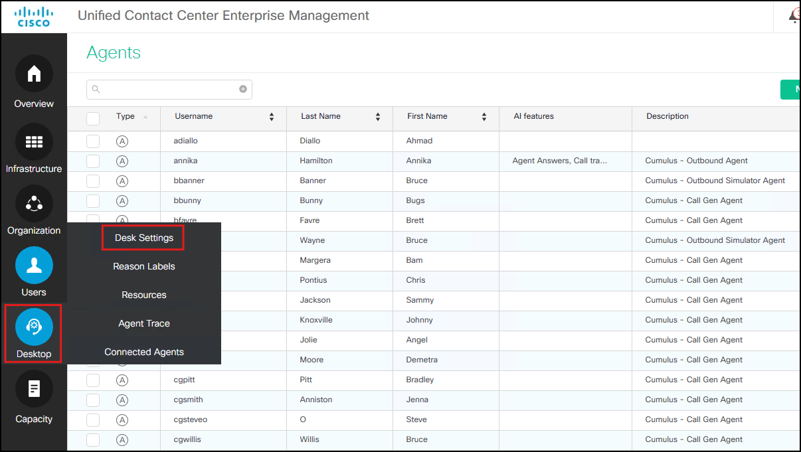
   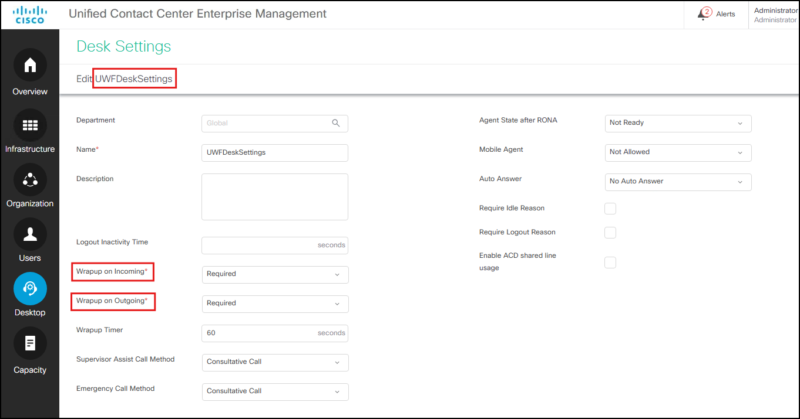   

**Step 2:**
Lastly, navigate to **Organization** -> **Teams** -> Select the team **Webex_AI_Team**.

   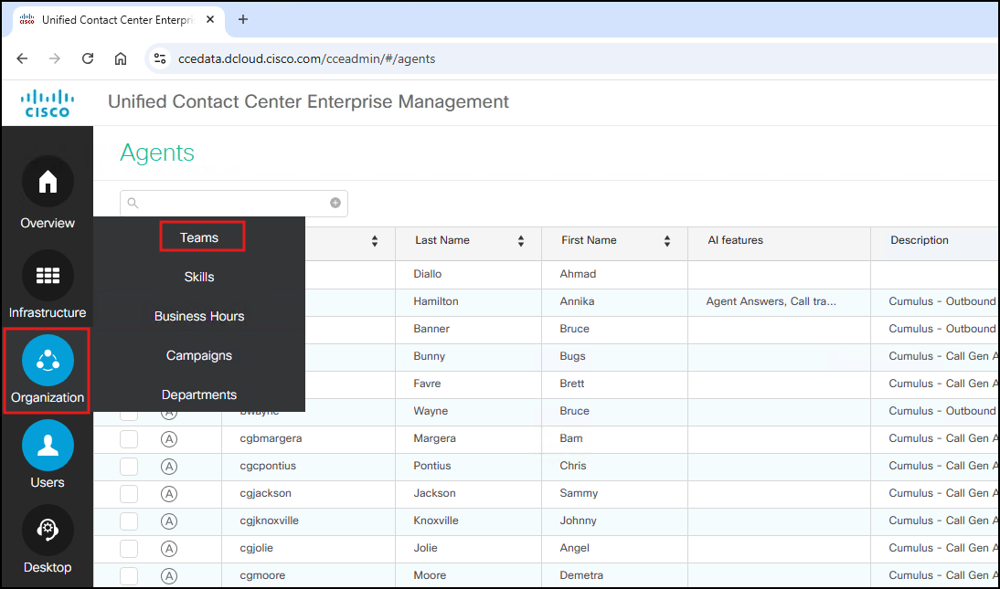
   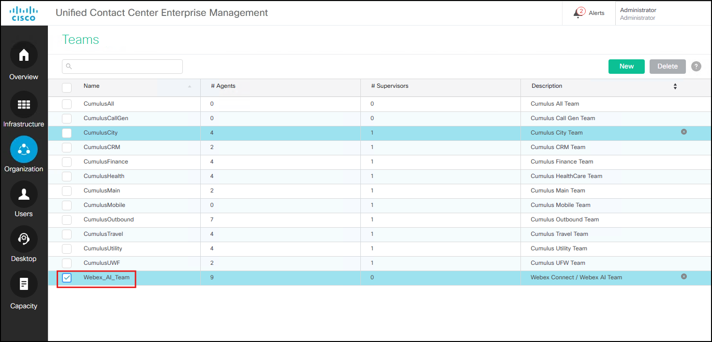

**Step 3:**
Select the **Team Resources** tab -> **Wrap-up Reasons** -> add at least one **Wrap-Up Reason** -> and click **Save**.

   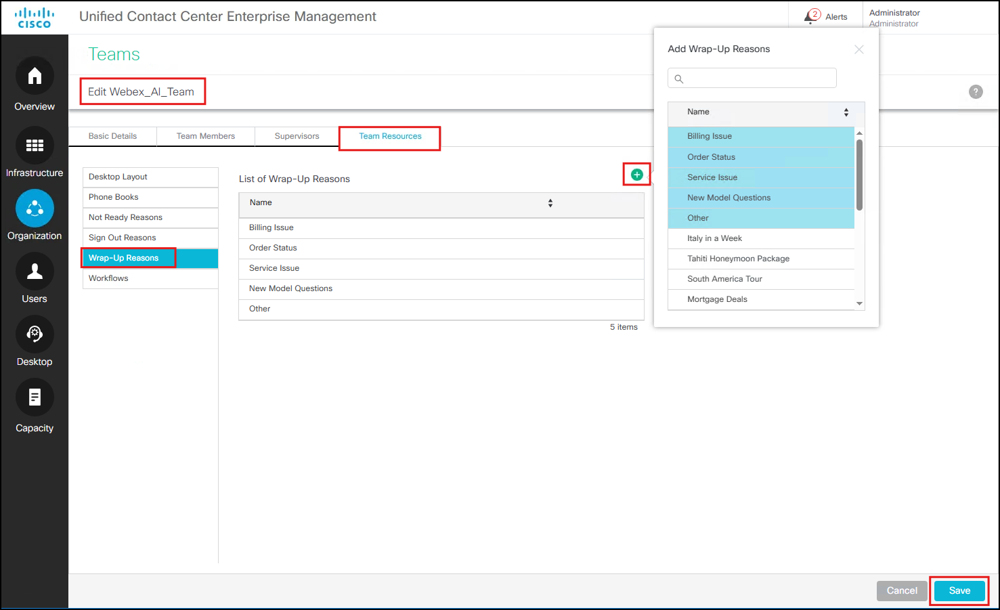

<strong>This now completes Lab 2!</strong>

