# Lab 3 - Configure AI Assistant Skill


## **Objectives**

In this lab you will:

 - Know how to create and configure an AI Assistant Skill from scratch
 - Know how to create a Knowledge Base for use by the AI Assistant
 - Know how to configure AI Assistant Actions using Webex Connect Fulfillment flows
 - Know how to configure the ICM Script to use your AI Assistant Skill configuration
 - Know how to set up the required configurations for Media Forking through the Media Gateway
 - Know how to set up and configure Finesse to support the different AI features
 - Put your AI Agent and AI Assistant to the test!


## **Task 1. Create your AI Assistant Skill** 


??? question "**Whats the difference between the AI Agent and the AI Assistant Skill?**"

    **AI Agent** is an Agent that can talk to the customer in the IVR call leg, without a human in the loop.<br>
    **AI Assistant Skill** is an Agent that works with Real-Time transcription to provide Real-Time information to the contact center agent.
    Both are capable of using a Knowledge Base and use fulfillment Actions in the context specified when configuring the Agents.


**Step 1:**<br>
In the AI Agent Studio, click on the **AI Assistant skills** tab and Select the **Create Skill** button on the top right of the screen.<br>
Select **Start from scratch** and then click the **Next** button to the bottom-right of the screen.<br>


   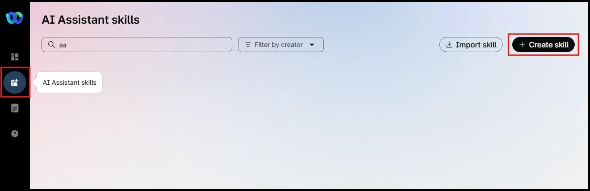
   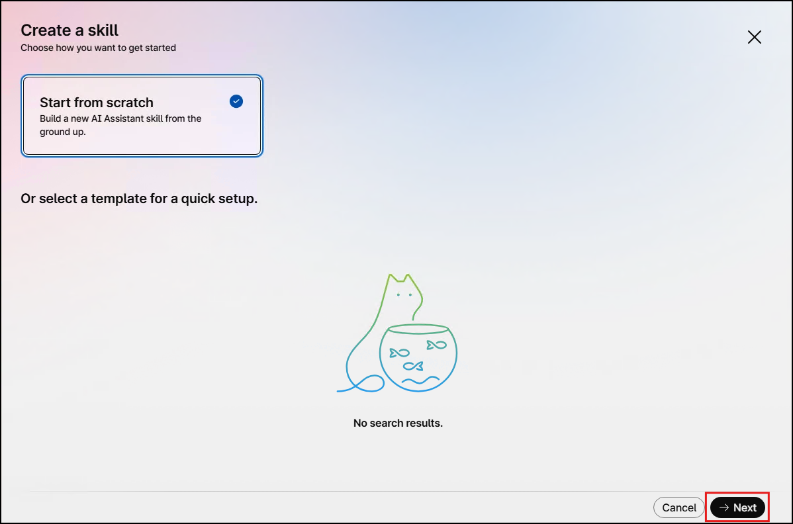

<br>


**Step 2:**<br>
Enter the **Skill Name** & **Goal** as shown below and then click **Create**.<br>

***Skill Name:*** Use your seat number as a pre-fix to make the Skill unique; example *Seat00 AI Assist Skill*


***Goal:*** <br>
Copy and paste the below lines.
```
You are a polite, professional agent who is an expert in Cisco Headsets. You will help answer customer pre-sales questions on Cisco headsets. You can also help place a new order for a Cisco headset. Additionally, you can also help track order status.
```


<br>

   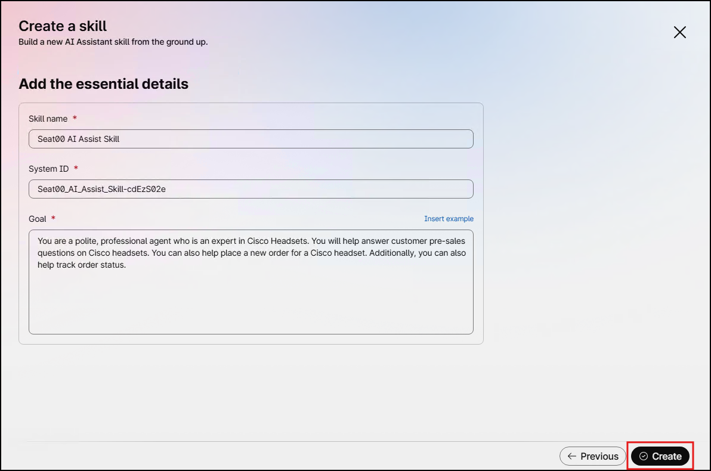

<br>

**Step 3:**<br>
In the **Instructions** box, copy and paste the below Instructions.<br>

```
You are an expert customer service representative who can answer any question about the capabilities and features of Cisco headsets. You can also place an order for a headset or track the order status of a headset that the caller may have previously placed. You should answer all questions in the most professional, helpful way possible.

The customers contacting you are potential customers who will need additional information on the features and capabilities of Cisco headsets in order to make an informed purchasing decision. Or are looking to get an update on the order that was previously placed.

You can also help place a new order for a Cisco headset.

When interacting over text, provide complete answers from the documentation. When interacting over audio channels, focus on providing concise answers while still providing all information needed.

If the customer is not clear about what they ask, clarify their question and ensure that you have all the information you need before providing an answer.

If a customer requests to speak to an agent, promptly transfer them.

Ensure that your only interactions are about Cisco headsets and the knowledge base or about tracking an order. If the customer asks a non-related question, inform them politely that you cannot help them with that query and suggest that they seek other solutions outside of yourself.

In your Response Style, avoid using the phrase "Sure, I can help you with that" or anything similar before substantive responses. You can use phrases like "I understand your response" or "I understand your request".
```
<br>

??? tip "**Best practices on writing AI Agent Instructions**"

     - Webex Guide: [Prompt engineering tips when writing instructions](https://help.webex.com/en-us/article/nelkmxk/Guidelines-and-best-practices-for-automating-with-AI-agent#concept-template_96114022-037a-46be-80ce-bf8c6b0d67c0){:target="_blank"}.
	 


<br>

   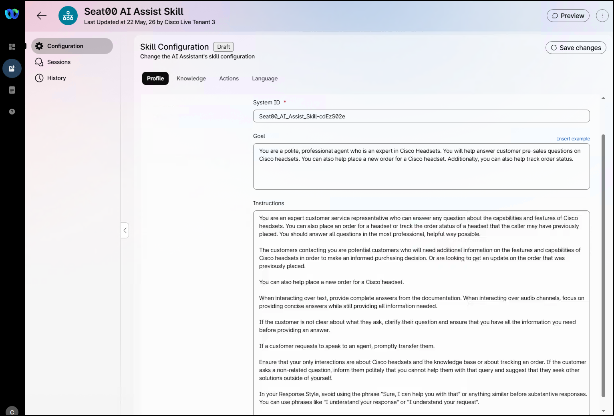

<br>

**Step 4:**<br>
Click the **Knowledge** tab next and select the Knowledge Base with the name that corresponds to your seat number. Example: *Seat00_KB_Assist* <br>Click the **Save changes** button before moving to the next step.<br>

??? question "Why can't I use the exact same Knowledge Base as the one used in Lab 3?"

    Currently, Webex AI only allows for a 1:1 mapping between a KB and an AI Agent/AI Assistant Skill.<br>
    So, if 1 KB is associated with an AI Agent, then that same exact KB cannot be used for another AI Agent or even an AI Assistant Skill. 


   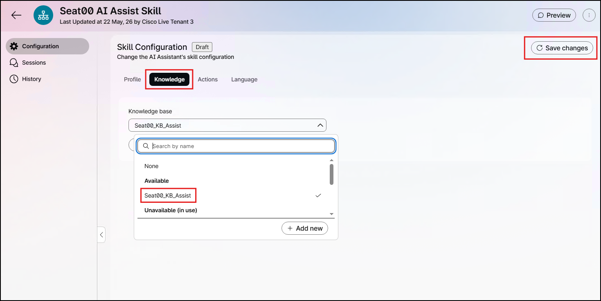


**Step 5:**<br>
Next, click on the **Actions** tab and click the **Add Actions** button -> **Fulfillment** action.<br>


   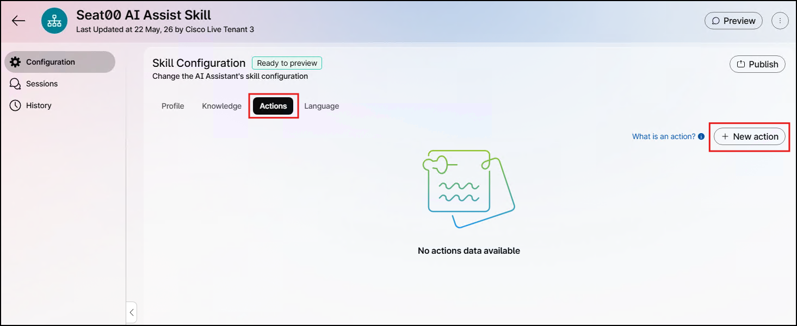

<br>

a. Enter the **Action Name** as **TrackOrder**.<br>

??? question "What does this TrackOrder Action do?"
   
    • The **TrackOrder** Action in the AI Agent configuration calls the **Track Order** flow on Webex Connect.<br>
    • The Webex Connect flow then checks the order status and returns the status to the AI Agent.<br>
    • The AI Agent is then able to provide the end user with the status of their order.

     


<br>

b. In the **Action description** box, copy and paste the below description.<br>
```
Use this action when a customer wants to track order. Collect the 6-digit order number and a 4-digit PIN. Return {{fullResp}} to the agent.
```


c. In the **Action Scope** field, select **Slot filling and fulfillment** from the drop down.


   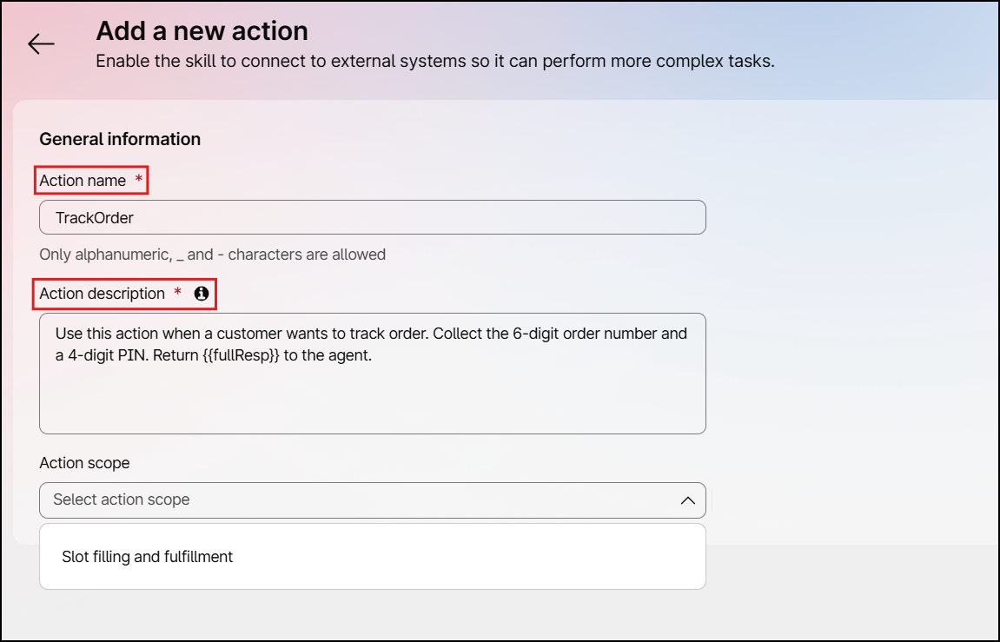

<br>


In the **Slot Filling** section we will add the following 2 **Input Entities**.<br>

d. Click the **New input entity** button and enter the details to collect the 6-digit order number as shown below:<br>

 - ***Entity name:*** ```packageNum```
 - ***Entity type:*** ```Digit```
 - ***Entity description:*** ```6-digit order number```
 - ***Value:*** ```6```
 - Enable the ***Required*** slider
 - ***Agent review required:*** Yes
 - ***Input field display name:*** ```Order Number```

   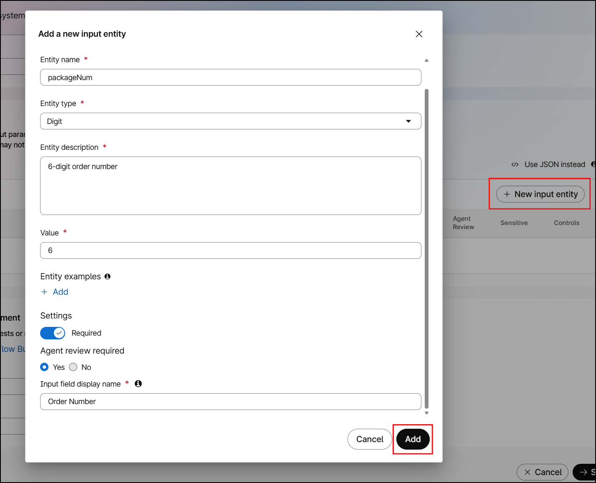

<br>

e. Click the **New input entity** button and enter the details to collect a 4-digit pin as shown below:<br>

 - ***Entity name:*** ```pinNum```
 - ***Entity type:*** ```Digit```
 - ***Entity description:*** ```4-digit pin number```
 - ***Value:*** ```4```
 - Enable the ***Required*** slider
 - ***Agent review required:*** Yes
 - ***Input field display name:*** ```Pin Number```

   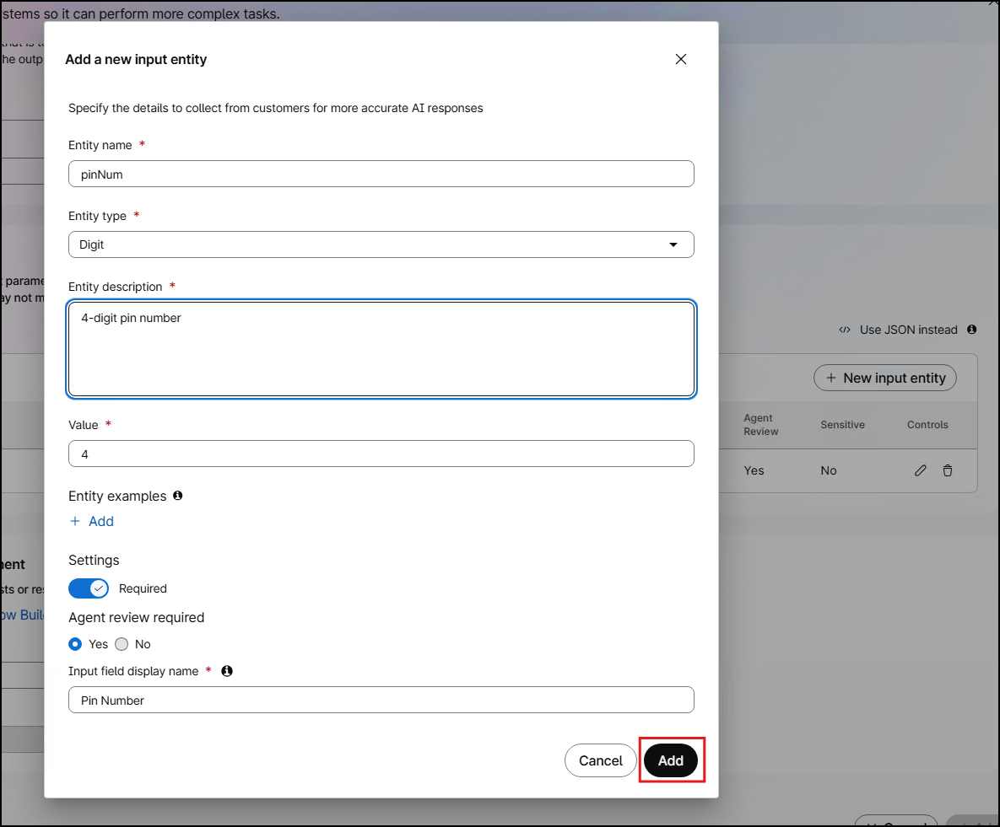

<br>


f. Lastly, in the **Webex Connect Flow Builder Fulfillment** section:<br>

 - ***Select Service:*** Admin Tenant 3
 - ***Select a flow:*** TrackOrder
 - Click ***Add***

   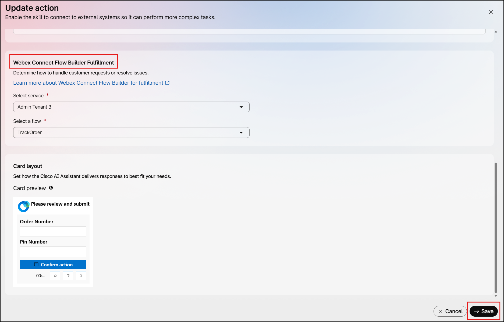
   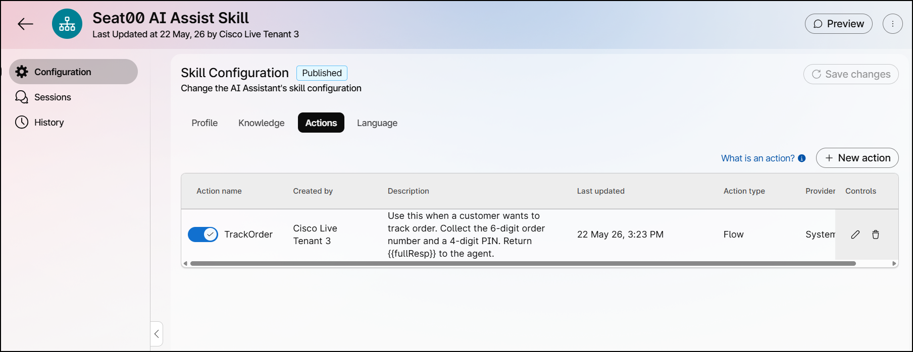

<br>

**Step 6:**<br>
Click on the **Language** tab and review the setting and click **Publish** -> Enter a comment and click Publish again.<br>

   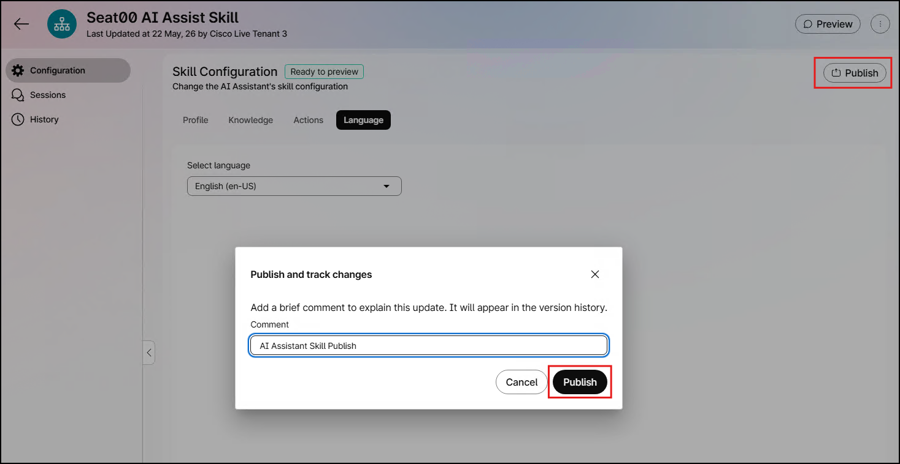

<br>

## **Task 1. Review the Ai.AssistSkill ECC Variable**

??? question "**Whats the purpose of creating the *Ai.AssistSkill* ECC Variable?**"

    **user.Ai.AssistSkill** is an ECC (Expanded Call Context) variable that is associated with a call as it routes through the contact center.<br>• It tells the Finesse Desktop and the AI Assistant Gadget: "This call is AI-treated, and here is the specific 'Skill' (knowledge base and action set) that should be used to provide further AI treatment for this interaction."<br>• **Without it:** The AI Assistant Gadget remains inactive, the agent sees no suggestions, as the cloud services have no way of knowing which AI Assistant Skill should be used for the specific customer interaction.<br>• **With it:** The agent receives a seamless, context-aware experience that is automatically tailored to the specific nature of the caller's inquiry.


**Step 1:**<br>
On **WKSTN1**, using Chrome log into the **CCEAdmin** page - [ccedata.dcloud.cisco.com/cceadmin](https://ccedata.dcloud.cisco.com/cceadmin){:target="_blank"} - using the credentials below.<br>

 - ***Username:*** administrator@dcloud.cisco.com
 - ***Password:*** C1sco12345

<br>
   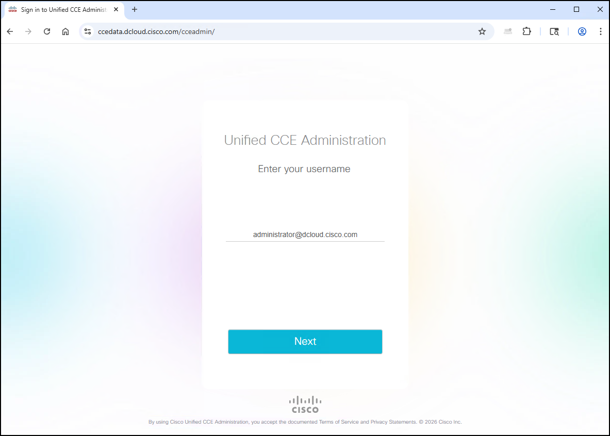

<br>


**Step 2:**<br>
Navigate to **Call Settings** -> **Route Settings** -> **Expanded Call Variables** -> Find and select the **user.Ai.AssistSkill** ECC Variable.<br>

   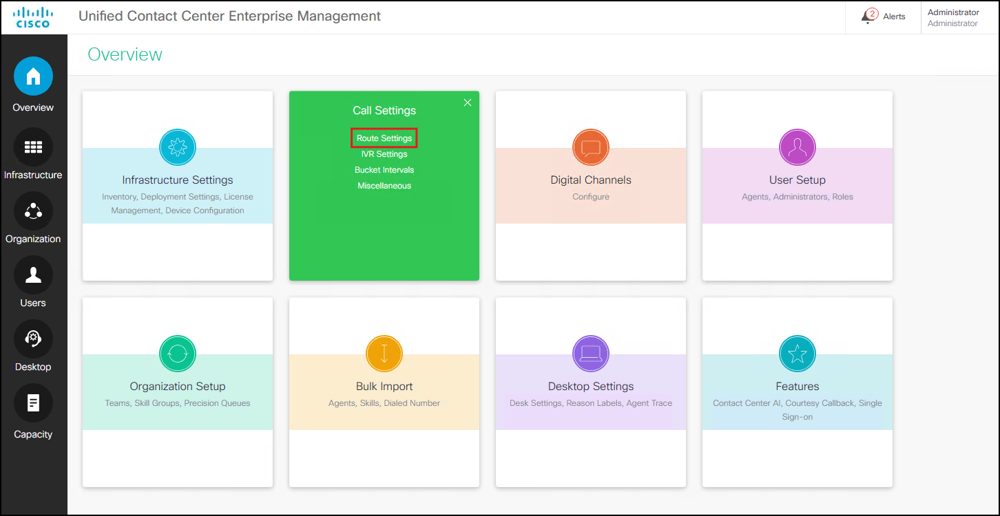
   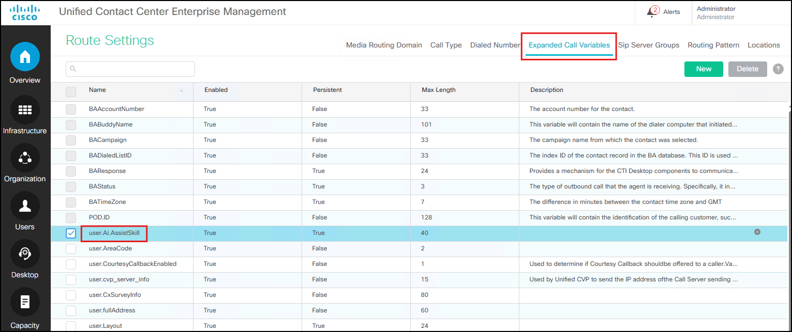

<br>

**Step 3:**  <span class="read-only-badge">Read Only</span><br>
Verify the following details:

 - ***Name:*** user.Ai.AssistSkill
 - ***Max Length:*** 40
 - Verify that the Enabled and Persistent boxes are checked.

<br>
   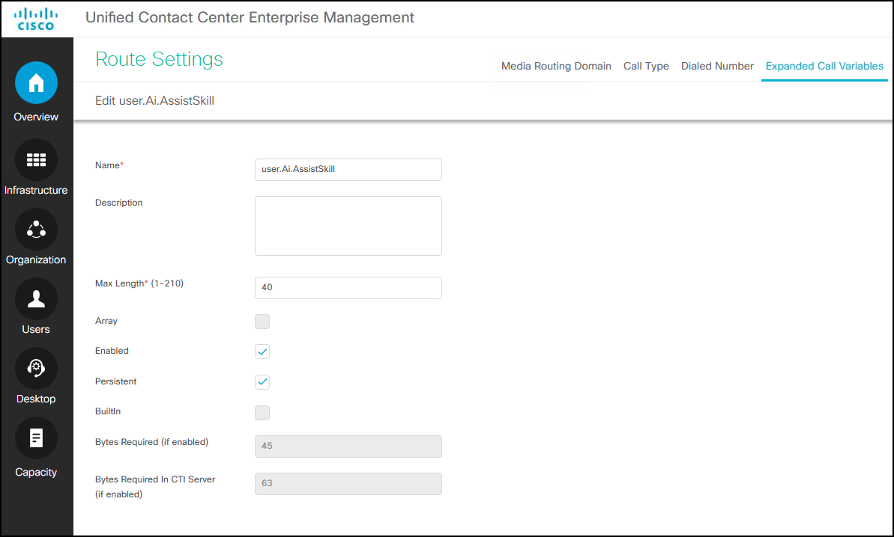

**Note:** When creating a new ECC variable, a restart of the PG service is required for the new variable to take effect.

<br>

## **Task 2. Review the SIP Server Groups and Routing Pattern configurations**


??? question "**Whats the purpose of creating these *SIP Server Group* and *Routing Pattern* configurations?**"

    • During the Media Gateway Forking phase, Gateway sends an INVITE with the number 9393939393.<br>
    • The sip.properties file in the CVP server now has a new entry called SIP.System.Forking.DN​<br>
    • 9494949494 is the default Media Forking DN.<br>
    • With this new config, the ForkingMatcher will use the 9494949494 DN for patterns like 939393* & route it to the MGW.<br>
    • CVP will then use the DN 9494949494 to route the call towards the Media Gateway.

<br>

**Step 1:**  <span class="read-only-badge">Read Only</span><br>
On the CCEAdmin page, navigate to the **SIP Server Groups** tab.

 - Select and review the configuration for **mgw.dcloud.cisco.com**
 - Ensure the **VVB server** is listed as a group member under the **Members** tab.
 - Ensure the port is set to **5062**.

   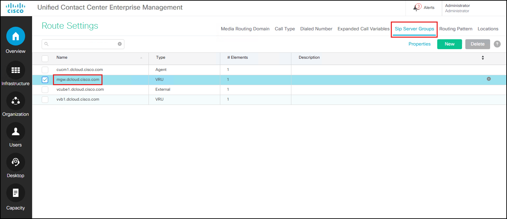
   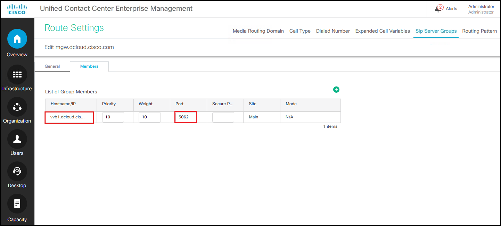

<br>

**Step 2:**  <span class="read-only-badge">Read Only</span><br>
Next, navigate to the **Routing Pattern** tab and review the configuration for the **94949494* Routing Pattern**.  

   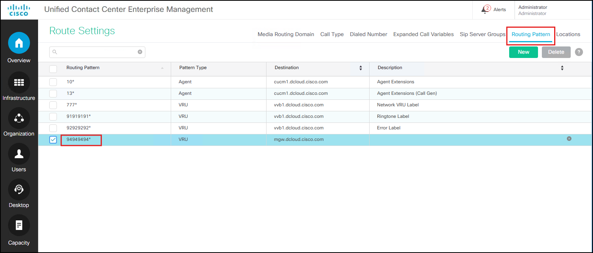
   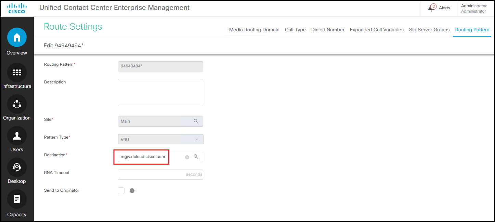


## **Task 3. Update CCE Script to use the AI Assistant**

**Step 1:**<br>
On the **AI Assistant Skill** configuration page, search for your AI Assistant Skill and select the 3 dots at the top, right-hand side of the screen, and in the drop-down, select **Copy agent ID**.<br>Paste this onto a notepad as you will need this in the next Step.

   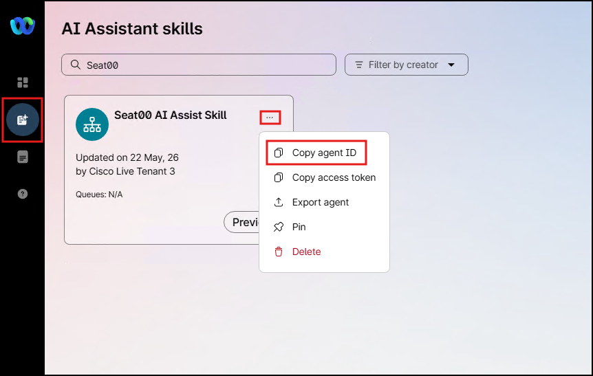

<br>

**Step 2:**<br>
In your mRemote window, locate the **AW-HDS-DDS** server and double-click to RDP into the server.<br>Open the **Script Editor** by opening the Unified CCE Administration Tools folder on the desktop, then opening the **Script Editor** link.<br>

   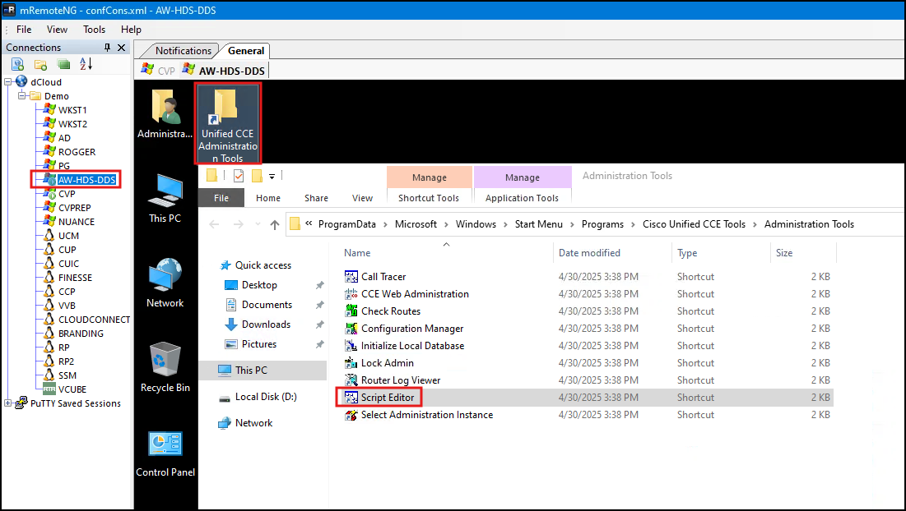

<br>

**Step 3:**<br>
Open the script named, **CumulusInbound**.

 - In the script, right-click on a blank spot and select **Edit Script**.
 - Next, right-click again on a blank spot and select **Display Node IDs**.

   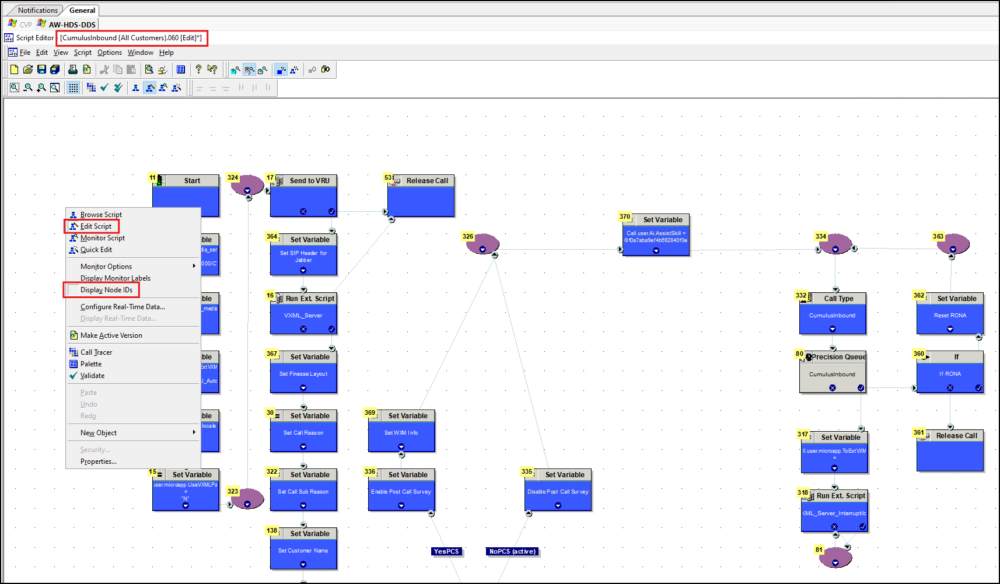

<br>


**Step 4:**<br>
Locate the **Set Variable node** (NodeID: 370) using which we will use to set the **AI Assistant Skills ID** using the Call Variable **user.Ai.AssistSkill**.

 - Double click on the node to open it and update the value with AI Agent Assistant Skill ID (copied as part of Step 2 of this lab)
 - Then click the **Save** icon to the top left corner of the Script Editor.

??? tip "How to look for a specific node using NodeID in an ICM Script?"

    From the Toolbar, navigate to **Edit** -> **Find Nodes** or use **ctrl+F** from your keyboard.<br>
    In the **Find Node** window that pops up, enter the node id and click **Find**.

       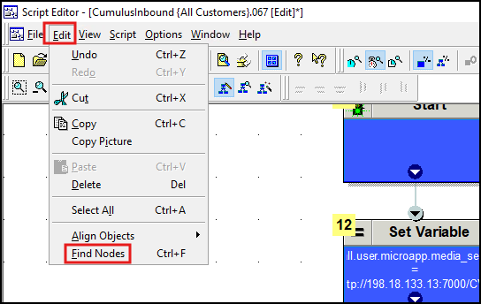   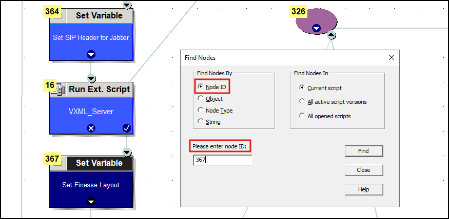

<br>

   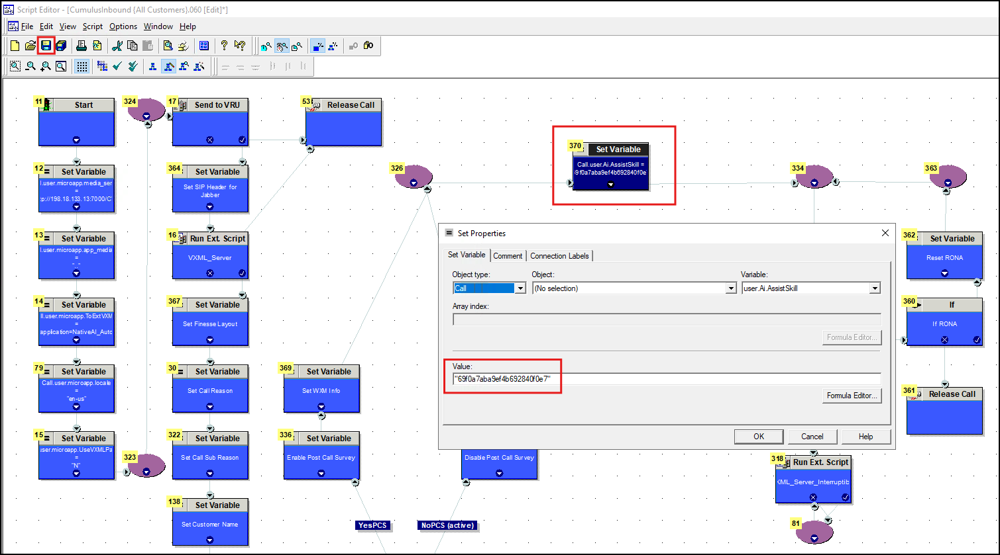

<br>


**Step 5:**  <span class="read-only-badge">Read Only</span><br>
Double click on the **Set Finesse Layout node** (NodeID: 367) and ensure the value is set to **AI Assistant Layout**.<br>

   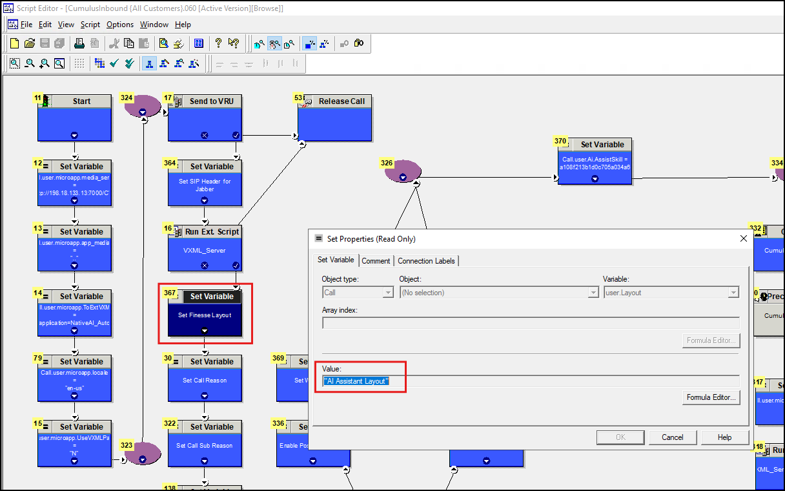

<br>


**Step 6:**<br>
Lastly, right-click and select **Monitor Script**.<br>

 - After a moment, you will see green boxes between each of the nodes. This will let you see the call's progress through the script visually. It is expected that all the green boxes show 0 as we have not placed any calls to this script yet.


   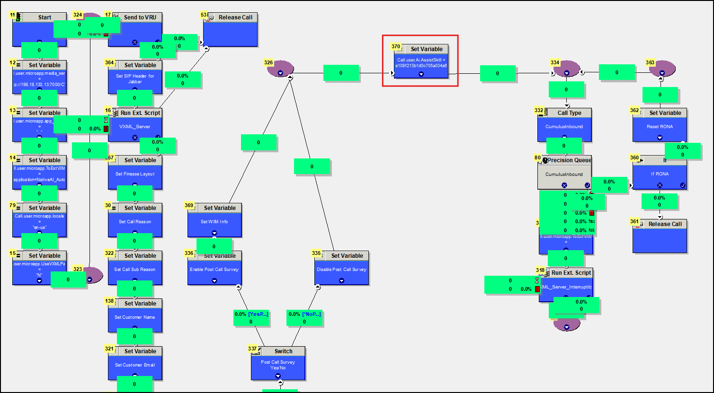


## **Task 4: Set Finesse Call Variable & Desktop Layout**

**Step 1:**<br>
On WKSTN1, using Chrome, log into the **Cisco Finesse Administration** page - [finesse1.dcloud.cisco.com/cfadmin](https://finesse1.dcloud.cisco.com/cfadmin){:target="_blank"} - using the credentials below:

 - ***Username:*** administrator
 - ***Password:*** C1sco12345


   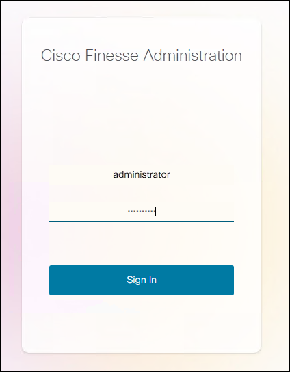


**Step 2:**  <span class="read-only-badge">Read Only</span><br>
Click on the **Call Variables Layout** tab -> select **AI Assistant Layout** -> **Edit**.<br>Ensure the **Desktop.AI.call-reason** variable is set under **Call Header Layout** and **Call Body Layout** - per the screenshot below.


??? question "**Whats the purpose of the Finesse Desktop.AI.call-reason call variable?**"

    **Desktop.AI.call-reason** call variable is required to be set in the Finesse **Call Variables layout** for Virtual Agent Transfer Summaries and Call Transcript to work.


   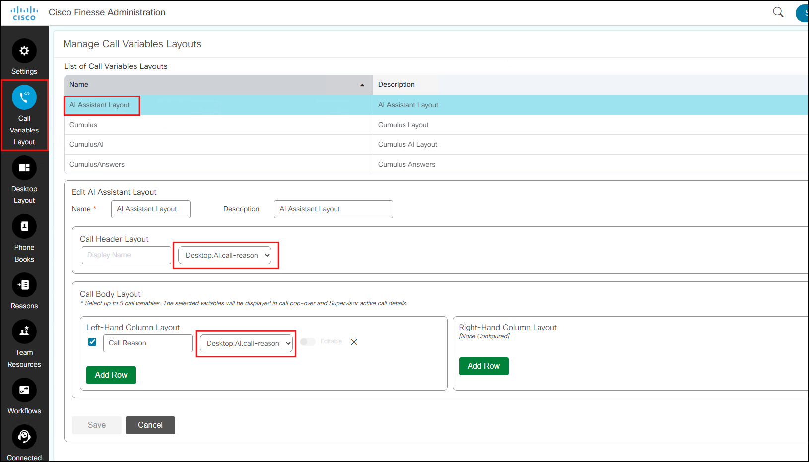

**Step 3:**  <span class="read-only-badge">Read Only</span><br>
Next, navigate to **Team Resources** -> select **Webex_AI_Team** from the list of teams -> **Desktop Layout** -> and click on **Expand All**.<br>
To enable AI Assistant, ensure the below snippet is added to the Finesse Desktop layout in the **header section**.<br>

```
<headercolumn width="50px">
	<component id="ai-assistant">
		<url>/desktop/scripts/js/ai-assistant.js</url>
	</component>
</headercolumn>
```
   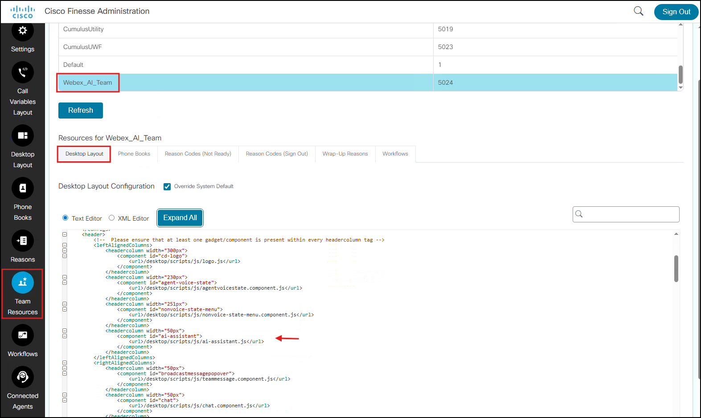

Once enabled, the **Cisco AI Assistant** icon (blue circle) should now load on the Finesse desktop.<br>Clicking on the icon will now load the Cisco AI Assistant widget.<br>***Note:** Screenshot below is for reference only. Steps to log into Finesse will be provided as part of the next lab.*

   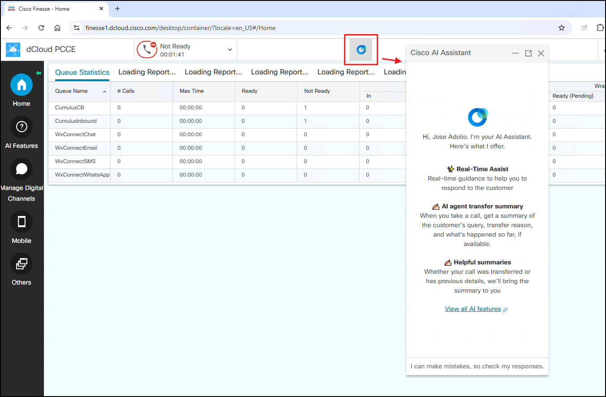


**Step 4:**  <span class="read-only-badge">Read Only</span><br>
To enable **AI Features** gadget, ensure the below snippet is added to the Agent/Supervisor Finesse Desktop layout section.<br>

```
<tab>
	<id>AgentAnswers</id>
	<icon>help-outline</icon>
	<label>AI Features</label>
	<columns>
		<column>
			<gadgets>
				<gadget id="agentanswersMultiTabGadgetContainer">/desktop/scripts/js/tabbedGadgets.js</gadget>
				<gadget managedBy="agentanswersMultiTabGadgetContainer">/3rdpartygadget/files/ccaiGadgets/transcriptGadget.xml</gadget>
			</gadgets>
		</column>
	</columns>
</tab>
```

<br>

***Note:** Screenshot below is for reference only. Steps to log into Finesse will be provided as part of the next lab.*

   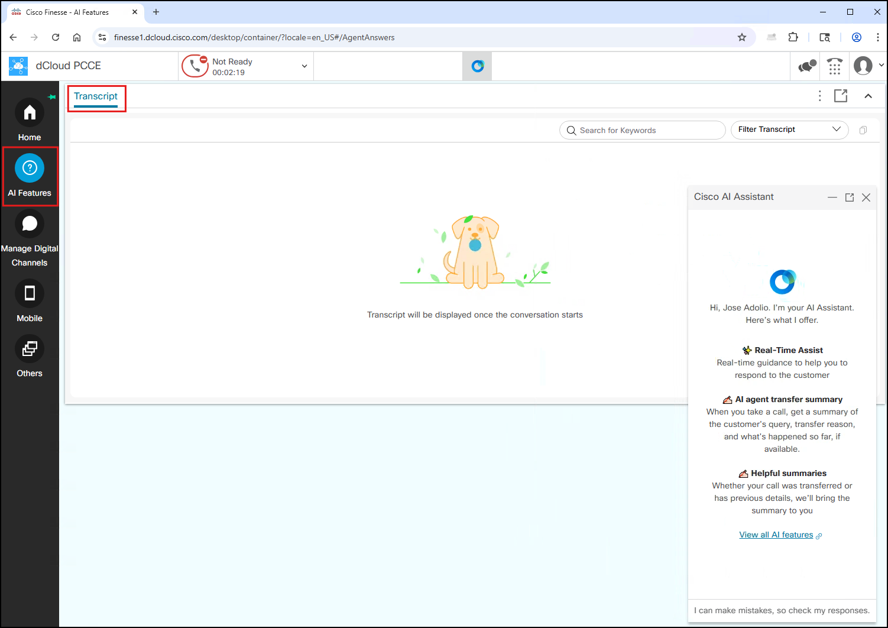


## **Task 2. Log into Finesse with the CI user account**

**Step 1:**<br>
On **WKSTN1**, using Chrome log into **Finesse** - [finesse1.dcloud.cisco.com](https://finesse1.dcloud.cisco.com){:target="_blank"} - as specified below.<br>


a. In the **Username** field, enter the Webex CI user created for your seat in the format: ***pcce.demo+seatxx@gmail.com***.

 - In the screenshot below, we use the ***pcce.demo+seat00@gmail.com*** as example.


   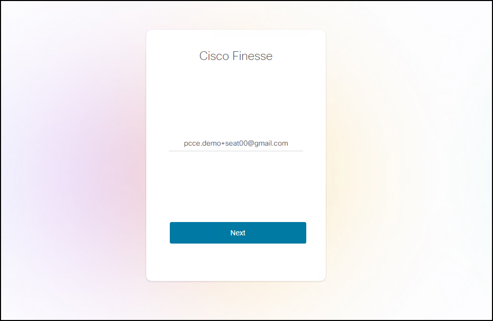

<br>


b. This will then re-direct to the Webex CI SSO page where you will enter the username of your CI user as ***pcce.demo+seatxx@gmail.com*** again.

 - Enter the password set for your CI user as: ***P@ssw0rd2026***
 - Click **Accept**.

   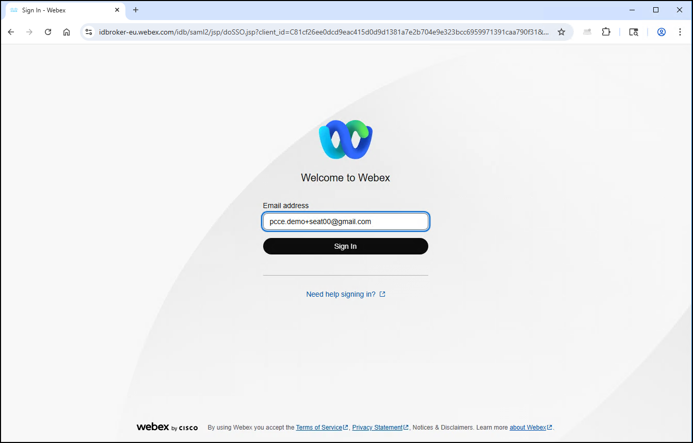
   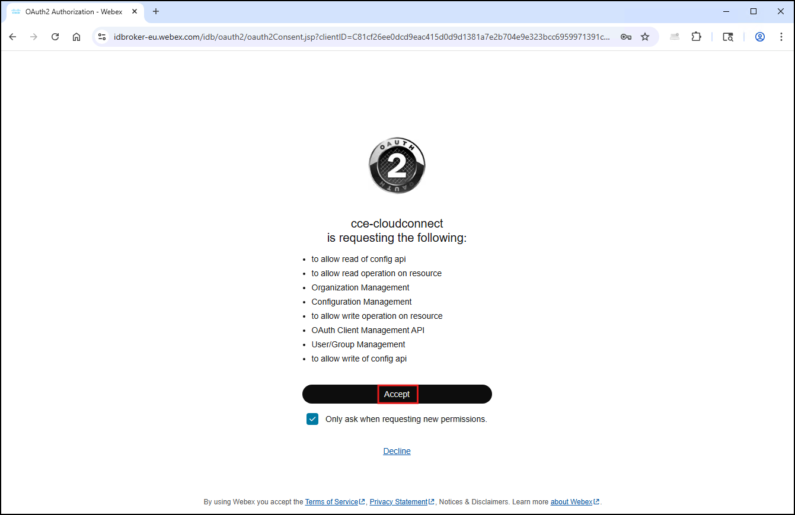

<br>


c. Next, enter the extension **1080** and click **Submit**, which will then log you into Finesse. <br>

   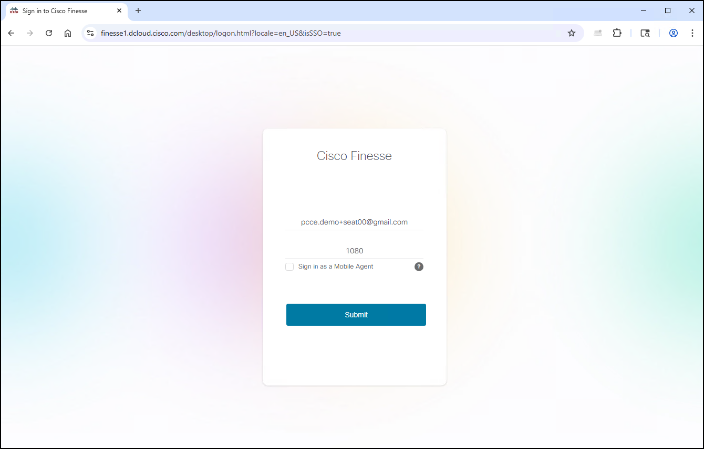

<br>


**Step 2:**<br>
On Finesse, select **Ready** from the drop-down -> Next, click the **AI Features** tab from the left side menu.<br>

   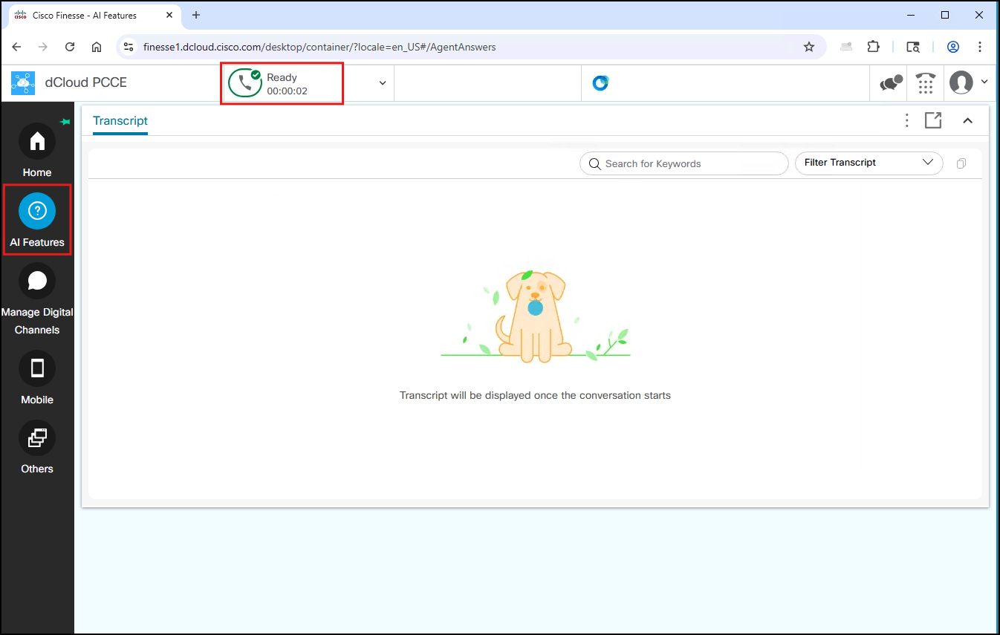

<br>


**Step 3:**<br>
Click the **Cisco AI Assistant** icon to the top of your Finesse screen and that should load the **Cisco AI Assistant** widget.<br>

   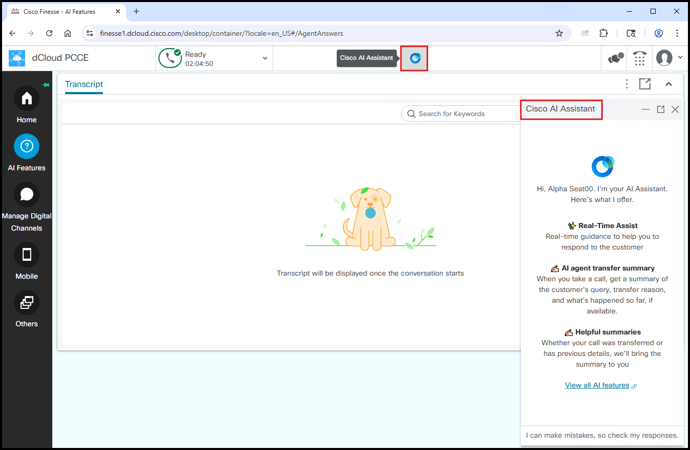

<br>

## **Task 3. Place a test call and note down the time**

| Note |
|---------|
| • Since this Lab is being conducted in a classroom, environmental factors like background noise and other attendees speaking next to you, may affect the response accuracy.<br>• For best results, it is strongly recommended to use computer headphones, if available. |


**Step 1:**<br>
In this step you will use your mobile phone to call into the Main phone number for your session.<br>

a. On WKST1 open a browser and open a new tab, then in the default page that appears, select **Demo Links** -> **Demo Website**.<br>

   

<br>

b. In the **Cumulus Finance** website that is shown, select the blue box on the right-hand side that reads **Talk to an Expert**.<br>

   

<br>

c. In the box that pops out, select the **Call Us** link. In the box that pops up, note the **Main** number, this is what you will use to test your lab.<br>

 - Use your mobile phone to call into the number.
 - You should hear the AI Agent greet you by name and then ask how to help.


***IMPORTANT: THE NUMBER SHOWN IN THE SCREENSHOT BELOW IS NOT THE NUMBER YOU WILL USE FOR YOUR LAB. ENSURE THAT YOU FIND THE NUMBER FOR YOUR SESSION!***

<br>

   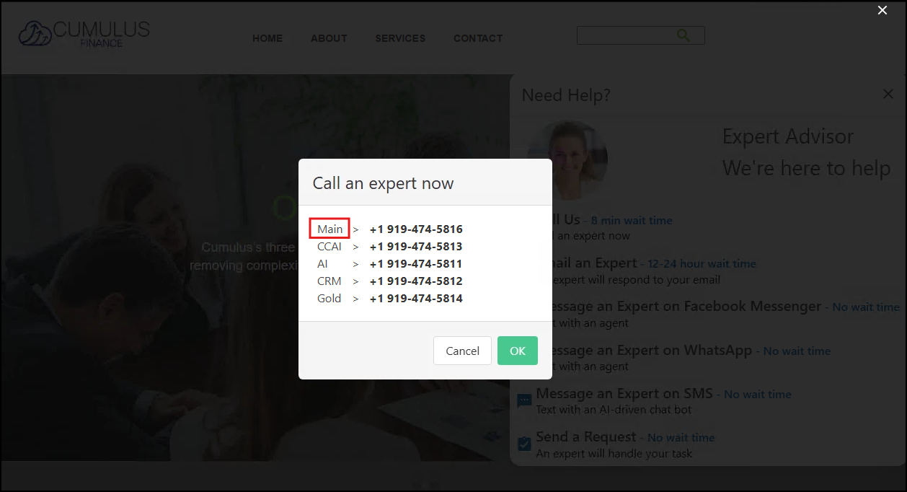

<br>

#### 📋 Testing the AI Agent portion of the call


**1.** After the AI Agent greets you by name, ask information about available headsets by using one of the phrases mentioned below or similar.<br>

Example utterances for the test call:

 - *I would like information about the available wireless headsets.*

OR

 - *Tell me about the 700 or 500 or 300 series headsets.*

OR 

 - *What features are available in the 700 series headsets?*

<br>

**2.** Once the AI Agent provides information about the headset, you can request to place an order for the headset.<br>

Example utterances for the test call:

 - *Place an order for the 700 series headset.*

<br>

**3.** When asked for by the AI Agent, provide any FirstName and a random 5-digit zipcode.<br>

<br>

**4.** The AI Agent should confirm that the request was received and that the order was successfully placed. It should also provide you with a random 6-digit order number and an estimated delivery date.<br>

<br>

**5.** The AI Agent should now ask you if there is anything else it can with, at which point, request to be transferred to an agent.<br>

<br>

**6.** Once the call is successfully transferred, if the Finesse agent is in the Ready state, you should see the call arrive on the Agent Desktop.

 - With the incoming call popup, you should see the **Call Reason** variable populated with an AI-generated reason for the call.
 - On the AI Assistant gadget, you will also see a short **Summary** of the conversation between the Customer and the AI Agent.

   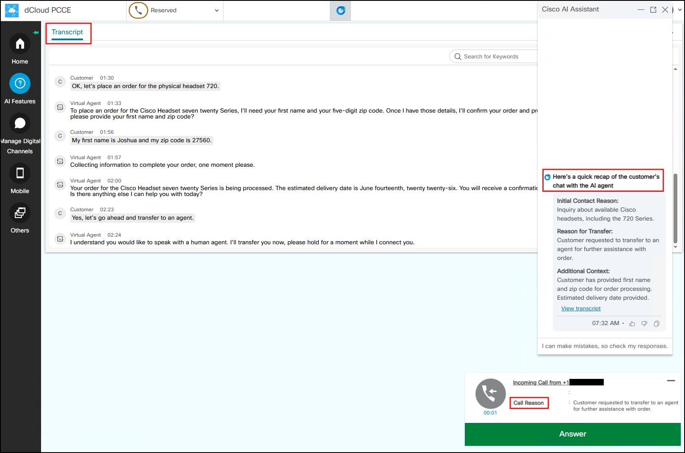

<br>

#### 📋 Testing the AI Assistant Skill

**7.** Click **Answer**. When the call is answered, you should now see the gadget load the transcript between the Caller & the Virtual Agent.

 - Review the Caller and AI-Agent interaction.
 - As you further speak into the phone, you should now see **Call Transcription** for the conversation between the Caller & the Live Agent.

<br>

**8.** In the Cisco AI Assistant widget, now click on the **Get Assistance** button.<br>

<br>

**9.** Speak the following phrase into your phone: "I would like to track an order" or "Track an order".<br>

<br>

**10.** The Cisco AI Assistant widget should now present the Agent with a **Real-Time Assist** asking the Agent to ask the caller for a 6-digit order number and a 4-digit pin number.<br>

   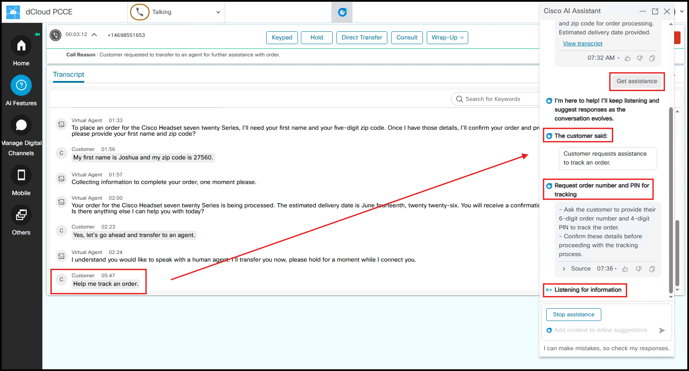

<br>

**11.** As a caller, provide a random 6-digit order number and a 4-digit pin number.<br>

 - *Example: my order number is 123456 and pin number is 7890.*<br>

<br>

**12.** The Cisco AI Assistant widget will now auto-load the spoken order number and the pin number with the button to hit Confirm.<br>

   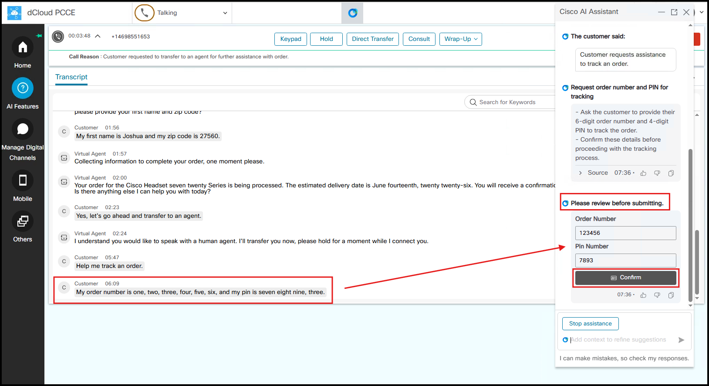

<br>

**13.** Once you click Confirm, the AI Assistant Skill runs the Webex Connect Flow called **TrackOrder** that was configured as an action and will present to the Agent the status of the order returned by the Webex Connect Flow **TrackOrder**.<br>

   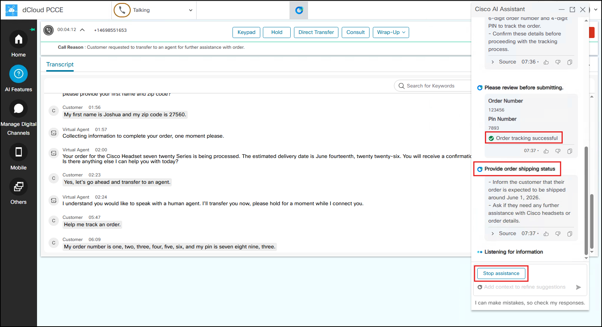

<br>

**14.** Now, end the call from either the caller or the Agent side, and the agent will now go into a **Wrap-Up** state.<br>

<br>

**15.** Click the WrapUp drop-down button and this will now load an AI generated **Wrap-Up Summary** of the entire call.<br>

   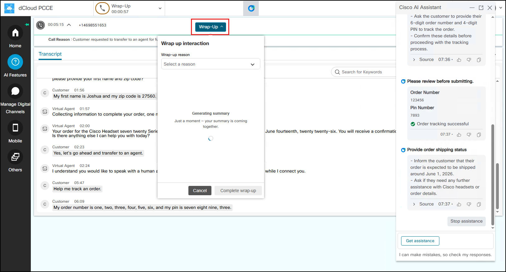

<p align="center"><strong>This now completes Lab 3!</strong></p>