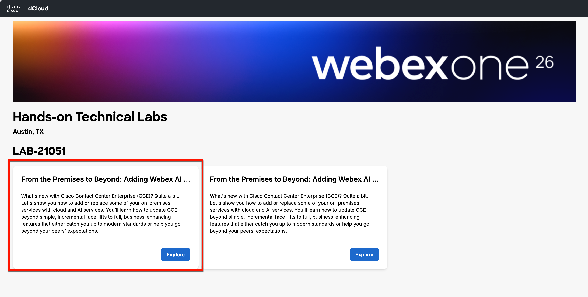
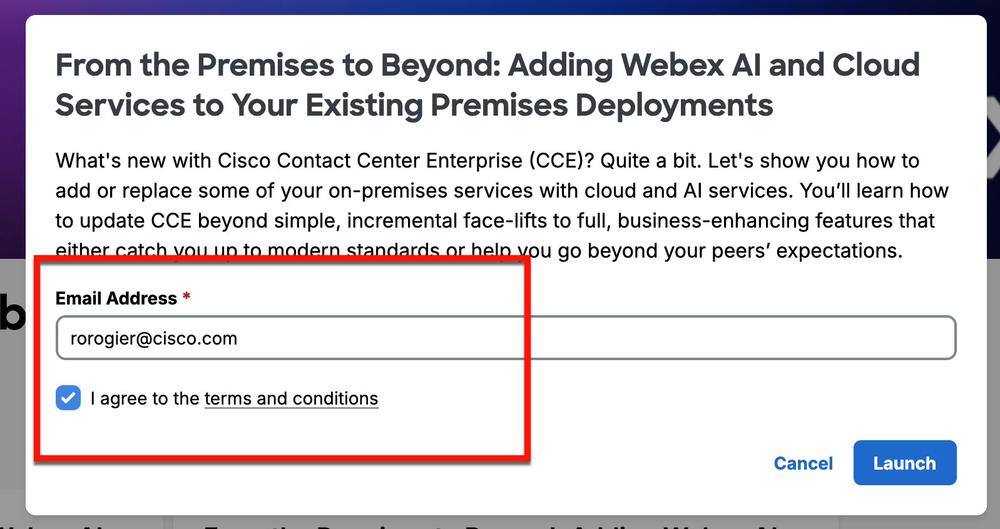
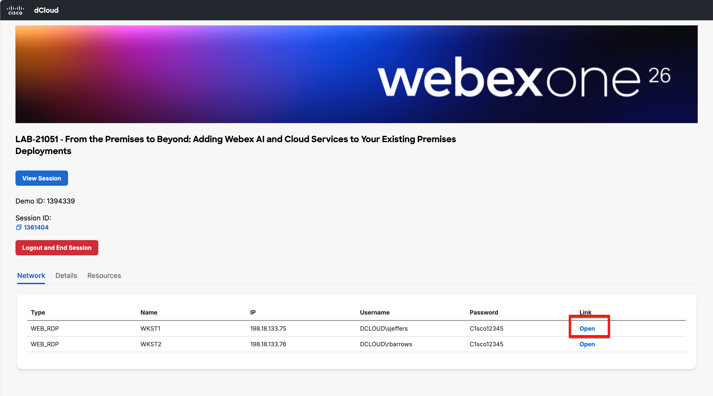

# dCloud Access

We are using Cisco eXpo for this lab. Click on the [Expo Link](https://www.ciscodcloud.com/apps/expo/3a09px4n9fqe2q80jtlw72n3e){:target="_blank"} 

**1.** We have sessions created in two different datacenters. Select the **Explore** button highlighted first. If you receive an error, please switch to the next.

   

 

**2.** Enter your email, then check the box to accept the dCloud Terms & Conditions. When you have done this, select **Continue**.

   

 

**3.** A session is now assigned for you to continue with. Select the **Remote Desktop** link next to WKST1 to open the jump box we will use for the entire lab.

   
